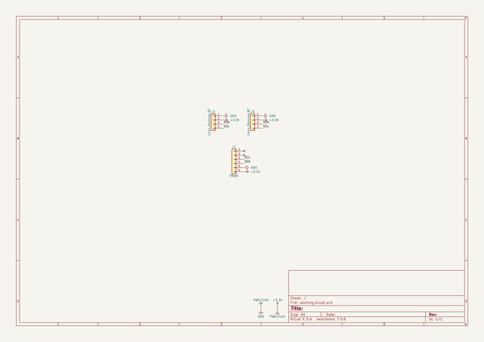
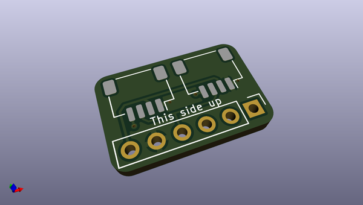
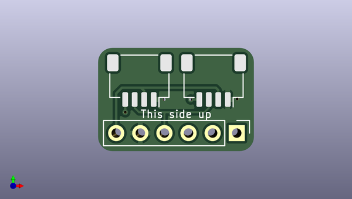
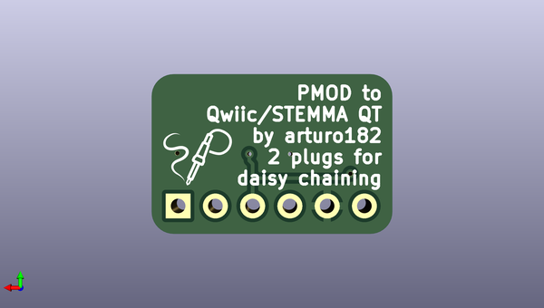

# pmod_to_qwiic_adapter
 
## summary 
* id: solderparty_pmod_to_qwiic_adapter_pmod_to_qwiic
* user: solderparty
* name: pmod_to_qwiic_adapter
* board: pmod_to_qwiic
* repo: https://github.com/solderparty/pmod_to_qwiic_adapter
* src_file_repo_kicad_pcb: pmod_to_qwiic.kicad_pcb
* src_file_repo_kicad_pcb_link: https://github.com/solderparty/pmod_to_qwiic_adapter/tree/main/pmod_to_qwiic.kicad_pcb
* src_file_repo_kicad_sch: pmod_to_qwiic.kicad_sch
* src_file_repo_kicad_sch_link: https://github.com/solderparty/pmod_to_qwiic_adapter/tree/main/pmod_to_qwiic.kicad_sch

* src_file_repo_sch: 
*
 src_file_repo_sch_link: https://github.com/solderparty/pmod_to_qwiic_adapter/tree/main/
* full details link: https://github.com/oomlout/oomlout_oomp_project_bot_v_2/tree/main/projects/solderparty_pmod_to_qwiic_adapter_pmod_to_qwiic/current_version/working  

## schematic  
  
[schematic (pdf)](working_schematic.pdf)  

## pcb  
 
  
  
  
[board (pdf)](working.pdf)  

## working_bom
| Id | Designator | Footprint | Quantity | Designation | Supplier and ref |  | None | 
| --- | --- | --- | --- | --- | --- | --- | --- | 
| 1 | J1 | PinHeader_1x06_P2.54mm_Vertical | 1 | PMOD |  |  | [''] | 
| 2 | J2,J3 | JST_SH_SM04B-SRSS-TB_1x04-1MP_P1.00mm_Horizontal | 2 | Conn_Stemma_QT |  |  | [''] | 
| 3 | G*** | SolderParty-New-Logo_5x4.2mm_SilkScreen | 1 | LOGO |  |  | [''] | 

## bom_schematic
| Ref | Qnty | Value | Cmp name | Footprint | Description | Vendor | DNP | 
| --- | --- | --- | --- | --- | --- | --- | --- | 
| J1 | 1 | PMOD | Conn_01x06 | Connector_PinHeader_2.54mm:PinHeader_1x06_P2.54mm_Vertical | Generic connector, single row, 01x06, script generated (kicad-library-utils/schlib/autogen/connector/) |  |  | 
| J2, J3 | 2 | Conn_Stemma_QT | Conn_01x04 | Connector_JST:JST_SH_SM04B-SRSS-TB_1x04-1MP_P1.00mm_Horizontal | Generic connector, single row, 01x04, script generated (kicad-library-utils/schlib/autogen/connector/) |  |  | 

