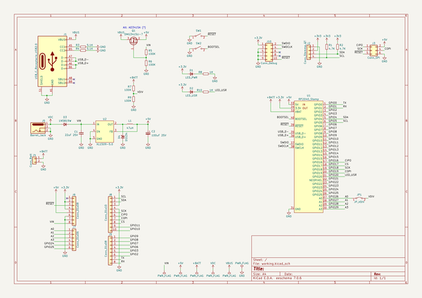
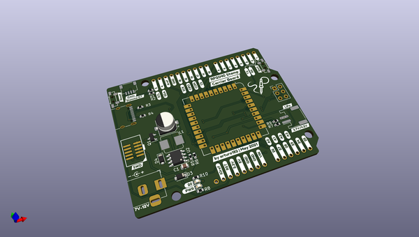
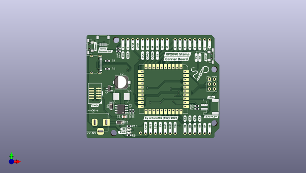
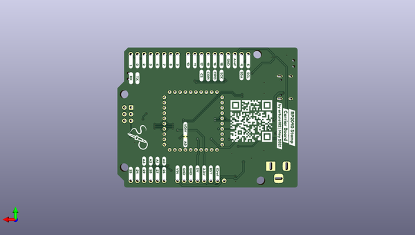

# rp2040_stamp_carrier_hw
 
## summary 
* id: solderparty_rp2040_stamp_carrier_hw_rp2040_stamp_carrier
* user: solderparty
* name: rp2040_stamp_carrier_hw
* board: rp2040_stamp_carrier
* repo: https://github.com/solderparty/rp2040_stamp_carrier_hw
* src_file_repo_kicad_pcb: rp2040_stamp_carrier.kicad_pcb
* src_file_repo_kicad_pcb_link: https://github.com/solderparty/rp2040_stamp_carrier_hw/tree/main/rp2040_stamp_carrier.kicad_pcb
* src_file_repo_kicad_sch: rp2040_stamp_carrier.kicad_sch
* src_file_repo_kicad_sch_link: https://github.com/solderparty/rp2040_stamp_carrier_hw/tree/main/rp2040_stamp_carrier.kicad_sch

* src_file_repo_sch: 
*
 src_file_repo_sch_link: https://github.com/solderparty/rp2040_stamp_carrier_hw/tree/main/
* full details link: https://github.com/oomlout/oomlout_oomp_project_bot_v_2/tree/main/projects/solderparty_rp2040_stamp_carrier_hw_rp2040_stamp_carrier/current_version/working  

## schematic  
  
[schematic (pdf)](working_schematic.pdf)  

## pcb  
 
  
  
  
[board (pdf)](working.pdf)  

## working_bom
| Id | Designator | Footprint | Quantity | Designation | Supplier and ref |  | None | 
| --- | --- | --- | --- | --- | --- | --- | --- | 
| 1 | D3 | D_SOD-123 | 1 | 1N5819W |  |  | [''] | 
| 2 | R2,R1 | R_0603_1608Metric | 2 | 4.7K |  |  | [''] | 
| 3 | SW2,SW1 | TL3330 | 2 | BTN_UP |  |  | [''] | 
| 4 | J4 | JST_PH_S2B-PH-SM4-TB_1x02-1MP_P2.00mm_Horizontal | 1 | Conn_Batt |  |  | [''] | 
| 5 | C1 | C_0805_2012Metric | 1 | 22uF 25V |  |  | [''] | 
| 6 | J1 | USB_C_Receptacle_XKB_U262-16XN-4BVC11 | 1 | USB_C_Receptacle_USB2.0 |  |  | [''] | 
| 7 | J2 | JST_SH_SM04B-SRSS-TB_1x04-1MP_P1.00mm_Horizontal | 1 | Conn_Stemma_QT |  |  | [''] | 
| 8 | R8,R10 | R_0603_1608Metric | 2 | 1K |  |  | [''] | 
| 9 | U2 | SOP-8_3.9x4.9mm_P1.27mm | 1 | XL1509-5.0 |  |  | [''] | 
| 10 | R4,R3 | R_0603_1608Metric | 2 | 5.1K |  |  | [''] | 
| 11 | D1 | LED_0603_1608Metric | 1 | LED_PWR |  |  | [''] | 
| 12 | G***,G*** | SolderParty-New-Logo_10x8.5mm_SilkScreen | 2 | LOGO |  |  | [''] | 
| 13 | R9,R6,R5,R7 | R_0603_1608Metric | 4 | 100K |  |  | [''] | 
| 14 | D2 | LED_0603_1608Metric | 1 | LED_USR |  |  | [''] | 
| 15 | C2 | CP_Elec_6.3x4.9 | 1 | 100uF 25V |  |  | [''] | 
| 16 | J5 | BarrelJack_Horizontal | 1 | Barrel_Jack |  |  | [''] | 
| 17 | Q1 | SOT-23 | 1 | DMG3415U-7 |  |  | [''] | 
| 18 | D4 | D_SOD-123F | 1 | DSS34 |  |  | [''] | 
| 19 | L1 | L_Bourns_SRP7028A_7.3x6.6mm | 1 | 47uH |  |  | [''] | 

## bom_schematic
| Ref | Qnty | Value | Cmp name | Footprint | Description | Vendor | DNP | 
| --- | --- | --- | --- | --- | --- | --- | --- | 
| C1 | 1 | 22uF 25V | C_Small | Capacitor_SMD:C_0805_2012Metric | Unpolarized capacitor, small symbol |  |  | 
| C2 | 1 | 100uF 25V | C_Polarized_Small | Capacitor_SMD:CP_Elec_6.3x4.9 | Polarized capacitor, small symbol |  |  | 
| D1 | 1 | LED_PWR | D_Small | LED_SMD:LED_0603_1608Metric | Diode, small symbol |  |  | 
| D2 | 1 | LED_USR | D_Small | LED_SMD:LED_0603_1608Metric | Diode, small symbol |  |  | 
| D3 | 1 | 1N5819W | D_Small | Diode_SMD:D_SOD-123 | Diode, small symbol |  |  | 
| D4 | 1 | DSS34 | D_Schottky_Small | Diode_SMD:D_SOD-123F | Schottky diode, small symbol |  |  | 
| J1 | 1 | USB_C_Receptacle_USB2.0 | USB_C_Receptacle_USB2.0 | Connector_USB:USB_C_Receptacle_XKB_U262-16XN-4BVC11 | USB 2.0-only Type-C Receptacle connector |  |  | 
| J2 | 1 | Conn_Stemma_QT | Conn_01x04 | Connector_JST:JST_SH_SM04B-SRSS-TB_1x04-1MP_P1.00mm_Horizontal | Generic connector, single row, 01x04, script generated (kicad-library-utils/schlib/autogen/connector/) |  |  | 
| J4 | 1 | Conn_Batt | Conn_01x02 | Connector_JST:JST_PH_S2B-PH-SM4-TB_1x02-1MP_P2.00mm_Horizontal | Generic connector, single row, 01x02, script generated (kicad-library-utils/schlib/autogen/connector/) |  |  | 
| J5 | 1 | Barrel_Jack | Barrel_Jack_Switch | Connector_BarrelJack:BarrelJack_Horizontal | DC Barrel Jack with an internal switch |  |  | 
| L1 | 1 | 47uH | L_Small | Inductor_SMD:L_Bourns_SRP7028A_7.3x6.6mm | Inductor, small symbol |  |  | 
| Q1 | 1 | DMG3415U-7 | BSS84 | Package_TO_SOT_SMD:SOT-23 | -0.13A Id, -50V Vds, P-Channel MOSFET, SOT-23 |  |  | 
| R1, R2 | 2 | 4.7K | R_Small | Resistor_SMD:R_0603_1608Metric | Resistor, small symbol |  |  | 
| R3, R4 | 2 | 5.1K | R_Small | Resistor_SMD:R_0603_1608Metric | Resistor, small symbol |  |  | 
| R5, R6, R7, R9 | 4 | 100K | R_Small | Resistor_SMD:R_0603_1608Metric | Resistor, small symbol |  |  | 
| R8, R10 | 2 | 1K | R_Small | Resistor_SMD:R_0603_1608Metric | Resistor, small symbol |  |  | 
| SW1, SW2 | 2 | BTN_UP | SW_SPST | Button_Switch_SMD_Extra:TL3330 | Single Pole Single Throw (SPST) switch |  |  | 
| U2 | 1 | XL1509-5.0 | XL1509-5.0 | Package_SO:SOP-8_3.9x4.9mm_P1.27mm |  |  |  | 

