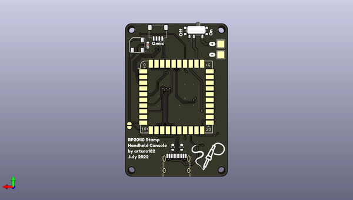

# rp2040_stamp_console_hw
 
## summary 
* id: solderparty_rp2040_stamp_console_hw_rp2040_stamp_console
* user: solderparty
* name: rp2040_stamp_console_hw
* board: rp2040_stamp_console
* repo: https://github.com/solderparty/rp2040_stamp_console_hw
* src_file_repo_kicad_pcb: rp2040_stamp_console.kicad_pcb
* src_file_repo_kicad_pcb_link: https://github.com/solderparty/rp2040_stamp_console_hw/tree/main/rp2040_stamp_console.kicad_pcb
* src_file_repo_kicad_sch: rp2040_stamp_console.kicad_sch
* src_file_repo_kicad_sch_link: https://github.com/solderparty/rp2040_stamp_console_hw/tree/main/rp2040_stamp_console.kicad_sch

* src_file_repo_sch: 
*
 src_file_repo_sch_link: https://github.com/solderparty/rp2040_stamp_console_hw/tree/main/
* full details link: https://github.com/oomlout/oomlout_oomp_project_bot_v_2/tree/main/projects/solderparty_rp2040_stamp_console_hw_rp2040_stamp_console/current_version/working  

## schematic  
  
[schematic (pdf)](working_schematic.pdf)  

## pcb  
 
  
  
  
[board (pdf)](working.pdf)  

## working_bom
| Id | Designator | Footprint | Quantity | Designation | Supplier and ref |  | None | 
| --- | --- | --- | --- | --- | --- | --- | --- | 
| 1 | SW5 | RMT-CZ66 | 1 | SW_A |  |  | [''] | 
| 2 | SW6 | RMT-CZ66 | 1 | SW_B |  |  | [''] | 
| 3 | R3,R2,R1 | R_0603_1608Metric | 3 | 2K |  |  | [''] | 
| 4 | R6 | R_0603_1608Metric | 1 | 390K |  |  | [''] | 
| 5 | C5,C3,C4,C2 | C_0603_1608Metric | 4 | 1uF |  |  | [''] | 
| 6 | SW3 | RMT-CZ66 | 1 | SW_LEFT |  |  | [''] | 
| 7 | DS1 | OLED-128O064D | 1 | OLED-128O064D |  |  | [''] | 
| 8 | SW1 | RMT-CZ66 | 1 | SW_UP |  |  | [''] | 
| 9 | SW4 | RMT-CZ66 | 1 | SW_RIGHT |  |  | [''] | 
| 10 | SW2 | RMT-CZ66 | 1 | SW_DOWN |  |  | [''] | 
| 11 | D1 | LED_RGBA_0606 | 1 | LED_BAGR |  |  | [''] | 
| 12 | LS1 | CMT-5023S | 1 | Speaker |  |  | [''] | 
| 13 | C1 | C_0603_1608Metric | 1 | 4.7uF |  |  | [''] | 
| 14 | J1 | USB_C_Receptacle_HRO_TYPE-C-31-M-12 | 1 | USB_C_Receptacle_USB2.0 |  |  | [''] | 
| 15 | J2 | JST_SH_SM04B-SRSS-TB_1x04-1MP_P1.00mm_Horizontal | 1 | Conn_Qwiic |  |  | [''] | 
| 16 | TP1 | TestPoint_Pad_2.5x2.5mm | 1 | TP_BATT+ |  |  | [''] | 
| 17 | R5,R4 | R_0603_1608Metric | 2 | 5.1K |  |  | [''] | 
| 18 | G*** | SolderParty-New-Logo_12.5x10.6mm_SilkScreen | 1 | LOGO |  |  | [''] | 
| 19 | SW7 | SW_SPDT_PCM12 | 1 | SW_POWER |  |  | [''] | 
| 20 | JP1 | SolderJumper-2_P1.3mm_Open_RoundedPad1.0x1.5mm | 1 | SJ_LOUDER |  |  | [''] | 
| 21 | TP2 | TestPoint_Pad_2.5x2.5mm | 1 | TP_BATT- |  |  | [''] | 
| 22 | U1 | RP2040_Stamp_SMD | 1 | RP2040_Stamp |  |  | [''] | 

## bom_schematic
| Ref | Qnty | Value | Cmp name | Footprint | Description | Vendor | DNP | 
| --- | --- | --- | --- | --- | --- | --- | --- | 
| C1 | 1 | 4.7uF | C_Small | Capacitor_SMD:C_0603_1608Metric | Unpolarized capacitor, small symbol |  |  | 
| C2, C3, C4, C5 | 4 | 1uF | C_Small | Capacitor_SMD:C_0603_1608Metric | Unpolarized capacitor, small symbol |  |  | 
| D1 | 1 | LED_BAGR | LED_GBAR | LED_SMD_Extra:LED_RGBA_0606 | RGB LED, green/blue/anode/red |  |  | 
| DS1 | 1 | OLED-128O064D | OLED-128O064D | Display:OLED-128O064D | OLED display 128x64 |  |  | 
| J1 | 1 | USB_C_Receptacle_USB2.0 | USB_C_Receptacle_USB2.0 | Connector_USB:USB_C_Receptacle_HRO_TYPE-C-31-M-12 | USB 2.0-only Type-C Receptacle connector |  |  | 
| J2 | 1 | Conn_Qwiic | Conn_01x04 | Connector_JST:JST_SH_SM04B-SRSS-TB_1x04-1MP_P1.00mm_Horizontal | Generic connector, single row, 01x04, script generated (kicad-library-utils/schlib/autogen/connector/) |  |  | 
| JP1 | 1 | SJ_LOUDER | SolderJumper_2_Open | Jumper:SolderJumper-2_P1.3mm_Open_RoundedPad1.0x1.5mm | Solder Jumper, 2-pole, open |  |  | 
| LS1 | 1 | Speaker | Speaker | Buzzer_Beeper_Extra:CMT-5023S | Speaker |  |  | 
| R1, R2, R3 | 3 | 2K | R_Small | Resistor_SMD:R_0603_1608Metric | Resistor, small symbol |  |  | 
| R4, R5 | 2 | 5.1K | R_Small | Resistor_SMD:R_0603_1608Metric | Resistor, small symbol |  |  | 
| R6 | 1 | 390K | R_Small | Resistor_SMD:R_0603_1608Metric | Resistor, small symbol |  |  | 
| SW1 | 1 | SW_UP | SW_SPST | Button_Switch_SMD_Extra:RMT-CZ66 | Single Pole Single Throw (SPST) switch |  |  | 
| SW2 | 1 | SW_DOWN | SW_SPST | Button_Switch_SMD_Extra:RMT-CZ66 | Single Pole Single Throw (SPST) switch |  |  | 
| SW3 | 1 | SW_LEFT | SW_SPST | Button_Switch_SMD_Extra:RMT-CZ66 | Single Pole Single Throw (SPST) switch |  |  | 
| SW4 | 1 | SW_RIGHT | SW_SPST | Button_Switch_SMD_Extra:RMT-CZ66 | Single Pole Single Throw (SPST) switch |  |  | 
| SW5 | 1 | SW_A | SW_SPST | Button_Switch_SMD_Extra:RMT-CZ66 | Single Pole Single Throw (SPST) switch |  |  | 
| SW6 | 1 | SW_B | SW_SPST | Button_Switch_SMD_Extra:RMT-CZ66 | Single Pole Single Throw (SPST) switch |  |  | 
| SW7 | 1 | SW_POWER | SW_SPDT | Button_Switch_SMD:SW_SPDT_PCM12 | Switch, single pole double throw |  |  | 
| TP1 | 1 | TP_BATT+ | TestPoint | TestPoint:TestPoint_Pad_2.5x2.5mm | test point |  |  | 
| TP2 | 1 | TP_BATT- | TestPoint | TestPoint:TestPoint_Pad_2.5x2.5mm | test point |  |  | 
| U1 | 1 | RP2040_Stamp | RP2040_Stamp | RP2040_Stamp:RP2040_Stamp_SMD |  |  |  | 

