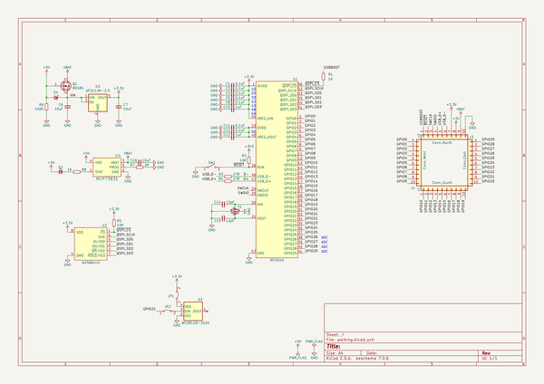
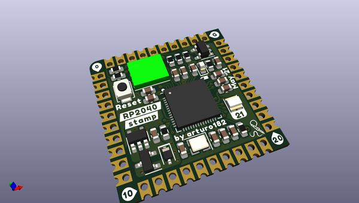
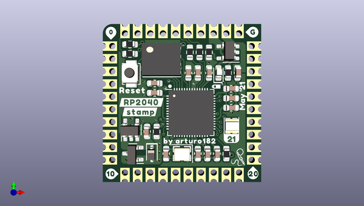
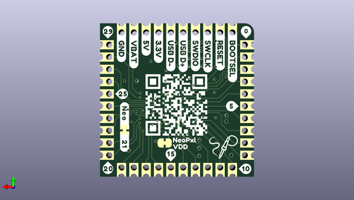

# rp2040_stamp_hw
 
## summary 
* id: solderparty_rp2040_stamp_hw_rp2040_stamp
* user: solderparty
* name: rp2040_stamp_hw
* board: rp2040_stamp
* repo: https://github.com/solderparty/rp2040_stamp_hw
* src_file_repo_kicad_pcb: rp2040_stamp.kicad_pcb
* src_file_repo_kicad_pcb_link: https://github.com/solderparty/rp2040_stamp_hw/tree/main/rp2040_stamp.kicad_pcb
* src_file_repo_kicad_sch: rp2040_stamp.kicad_sch
* src_file_repo_kicad_sch_link: https://github.com/solderparty/rp2040_stamp_hw/tree/main/rp2040_stamp.kicad_sch

* src_file_repo_sch: 
*
 src_file_repo_sch_link: https://github.com/solderparty/rp2040_stamp_hw/tree/main/
* full details link: https://github.com/oomlout/oomlout_oomp_project_bot_v_2/tree/main/projects/solderparty_rp2040_stamp_hw_rp2040_stamp/current_version/working  

## schematic  
  
[schematic (pdf)](working_schematic.pdf)  

## pcb  
 
  
  
  
[board (pdf)](working.pdf)  

## working_bom
| Id | Designator | Footprint | Quantity | Designation | Supplier and ref |  | None | 
| --- | --- | --- | --- | --- | --- | --- | --- | 
| 1 | R2,R5 | R_0603_1608Metric | 2 | 10K |  |  | [''] | 
| 2 | R8,R1 | R_0603_1608Metric | 2 | 1K |  |  | [''] | 
| 3 | U2 | SOT-23-5 | 1 | AP2112K-3.3 |  |  | [''] | 
| 4 | G*** | SolderParty-New-Logo_3x2.5mm_SilkScreen | 1 | LOGO |  |  | [''] | 
| 5 | U1 | QFN-56_EP_7x7_Pitch0.4mm | 1 | RP2040 |  |  | [''] | 
| 6 | D3 | WS2812B-2020 | 1 | WS2812B-2020 |  |  | [''] | 
| 7 | C15,C14 | C_0603_1608Metric | 2 | 12pF |  |  | [''] | 
| 8 | U4 | SOT-23-5 | 1 | MCP73831 |  |  | [''] | 
| 9 | C7,C6,C16 | C_0603_1608Metric | 3 | 10uF |  |  | [''] | 
| 10 | C13,C10 | C_0603_1608Metric | 2 | 1uF |  |  | [''] | 
| 11 | C12,C5,C11,C4,C8,C1,C3 | C_0603_1608Metric | 7 | 0.1uF |  |  | [''] | 
| 12 | D2 | LED_0603_1608Metric | 1 | LED_CHR |  |  | [''] | 
| 13 | R7 | R_0603_1608Metric | 1 | 2K |  |  | [''] | 
| 14 | U3 | WSON-8-1EP_6x5mm_P1.27mm_EP3.4x4mm | 1 | W25Q64JV |  |  | [''] | 
| 15 | R6 | R_0603_1608Metric | 1 | 100K |  |  | [''] | 
| 16 | SW1 | SW_SPST_B3U-1000P | 1 | SW_RESET |  |  | [''] | 
| 17 | R3,R4 | R_0603_1608Metric | 2 | 27R |  |  | [''] | 
| 18 | Q1 | SOT-23 | 1 | BSS84 |  |  | [''] | 
| 19 | D1 | D_SOD-323 | 1 | D_Schottky_Small |  |  | [''] | 
| 20 | Y1 | Crystal_SMD_2520-4Pin_2.5x2.0mm | 1 | XYDBPCNANF-12MHZ |  |  | [''] | 
| 21 | JP1 | SolderJumper-2_P1.3mm_Bridged_RoundedPad1.0x1.5mm | 1 | Jumper_Neopixel_VDD |  |  | [''] | 
| 22 | JP2 | SolderJumper-2_P1.3mm_Bridged_RoundedPad1.0x1.5mm | 1 | Jumper_Neopixel |  |  | [''] | 
| 23 | G*** | SolderParty-New-Logo_5x4.2mm_SilkScreen | 1 | LOGO |  |  | [''] | 

## bom_schematic
| Ref | Qnty | Value | Cmp name | Footprint | Description | Vendor | DNP | 
| --- | --- | --- | --- | --- | --- | --- | --- | 
| C1, C3, C4, C5, C8, C11, C12 | 7 | 0.1uF | C_Small | Capacitor_SMD:C_0603_1608Metric | Unpolarized capacitor, small symbol |  |  | 
| C6, C7, C16 | 3 | 10uF | C_Small | Capacitor_SMD:C_0603_1608Metric | Unpolarized capacitor, small symbol |  |  | 
| C10, C13 | 2 | 1uF | C_Small | Capacitor_SMD:C_0603_1608Metric | Unpolarized capacitor, small symbol |  |  | 
| C14, C15 | 2 | 12pF | C_Small | Capacitor_SMD:C_0603_1608Metric | Unpolarized capacitor, small symbol |  |  | 
| D1 | 1 | D_Schottky_Small | D_Schottky_Small | Diode_SMD:D_SOD-323 | Schottky diode, small symbol |  |  | 
| D2 | 1 | LED_CHR | LED_Small | LED_SMD:LED_0603_1608Metric | Light emitting diode, small symbol |  |  | 
| D3 | 1 | WS2812B-2020 | WS2812B-2020 | LED_SMD_Extra:WS2812B-2020 |  |  |  | 
| J1 | 1 | Conn_South | Conn_01x10 | RP2040_stamp:Castellated_1x10_P2.00mm_Vertical | Generic connector, single row, 01x10, script generated (kicad-library-utils/schlib/autogen/connector/) |  |  | 
| J2 | 1 | Conn_North | Conn_01x10 | RP2040_stamp:Castellated_1x10_P2.00mm_Vertical | Generic connector, single row, 01x10, script generated (kicad-library-utils/schlib/autogen/connector/) |  |  | 
| J3 | 1 | Conn_East | Conn_01x10 | RP2040_stamp:Castellated_1x10_P2.00mm_Vertical | Generic connector, single row, 01x10, script generated (kicad-library-utils/schlib/autogen/connector/) |  |  | 
| J4 | 1 | Conn_West | Conn_01x10 | RP2040_stamp:Castellated_1x10_P2.00mm_Vertical | Generic connector, single row, 01x10, script generated (kicad-library-utils/schlib/autogen/connector/) |  |  | 
| JP1 | 1 | Jumper_Neopixel_VDD | Jumper_2_Bridged | Jumper:SolderJumper-2_P1.3mm_Bridged_RoundedPad1.0x1.5mm | Jumper, 2-pole, closed/bridged |  |  | 
| JP2 | 1 | Jumper_Neopixel | Jumper_2_Bridged | Jumper:SolderJumper-2_P1.3mm_Bridged_RoundedPad1.0x1.5mm | Jumper, 2-pole, closed/bridged |  |  | 
| Q1 | 1 | BSS84 | BSS84 | Package_TO_SOT_SMD:SOT-23 | -0.13A Id, -50V Vds, P-Channel MOSFET, SOT-23 |  |  | 
| R1, R8 | 2 | 1K | R_Small | Resistor_SMD:R_0603_1608Metric | Resistor, small symbol |  |  | 
| R2, R5 | 2 | 10K | R_Small | Resistor_SMD:R_0603_1608Metric | Resistor, small symbol |  |  | 
| R3, R4 | 2 | 27R | R_Small | Resistor_SMD:R_0603_1608Metric | Resistor, small symbol |  |  | 
| R6 | 1 | 100K | R_Small | Resistor_SMD:R_0603_1608Metric | Resistor, small symbol |  |  | 
| R7 | 1 | 2K | R_Small | Resistor_SMD:R_0603_1608Metric | Resistor, small symbol |  |  | 
| SW1 | 1 | SW_RESET | SW_SPST | Button_Switch_SMD:SW_SPST_B3U-1000P | Single Pole Single Throw (SPST) switch |  |  | 
| U1 | 1 | RP2040 | RP2040 | Package_DFN_QFN_Extra:QFN-56_EP_7x7_Pitch0.4mm |  |  |  | 
| U2 | 1 | AP2112K-3.3 | AP2112K-3.3 | Package_TO_SOT_SMD:SOT-23-5 | 600mA low dropout linear regulator, with enable pin, 3.8V-6V input voltage range, 3.3V fixed positive output, SOT-23-5 |  |  | 
| U3 | 1 | W25Q64JV | W25Q64JV | Package_SON:WSON-8-1EP_6x5mm_P1.27mm_EP3.4x4mm |  |  |  | 
| U4 | 1 | MCP73831 | MCP73831 | Package_TO_SOT_SMD:SOT-23-5 |  |  |  | 
| Y1 | 1 | XYDBPCNANF-12MHZ | Crystal_GND24_Small | Crystal:Crystal_SMD_2520-4Pin_2.5x2.0mm | Four pin crystal, GND on pins 2 and 4, small symbol |  |  | 

