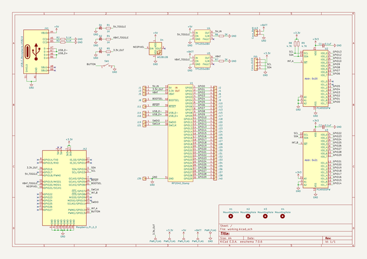
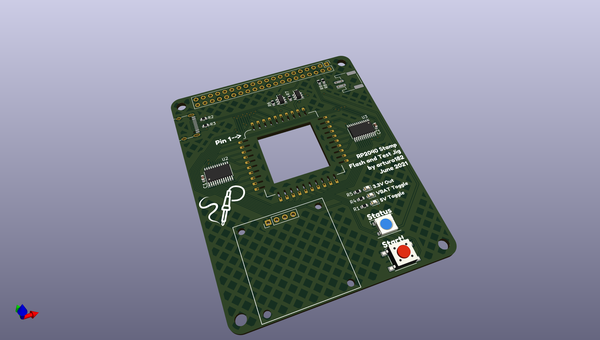
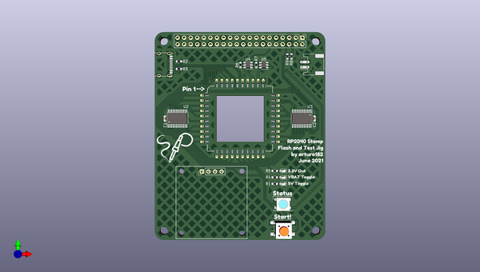
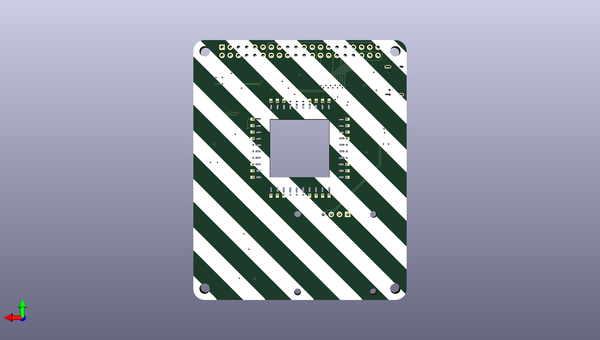

# rp2040_stamp_jig_hw
 
## summary 
* id: solderparty_rp2040_stamp_jig_hw_rp2040_stamp_jig
* user: solderparty
* name: rp2040_stamp_jig_hw
* board: rp2040_stamp_jig
* repo: https://github.com/solderparty/rp2040_stamp_jig_hw
* src_file_repo_kicad_pcb: rp2040_stamp_jig.kicad_pcb
* src_file_repo_kicad_pcb_link: https://github.com/solderparty/rp2040_stamp_jig_hw/tree/main/rp2040_stamp_jig.kicad_pcb
* src_file_repo_kicad_sch: rp2040_stamp_jig.kicad_sch
* src_file_repo_kicad_sch_link: https://github.com/solderparty/rp2040_stamp_jig_hw/tree/main/rp2040_stamp_jig.kicad_sch

* src_file_repo_sch: 
*
 src_file_repo_sch_link: https://github.com/solderparty/rp2040_stamp_jig_hw/tree/main/
* full details link: https://github.com/oomlout/oomlout_oomp_project_bot_v_2/tree/main/projects/solderparty_rp2040_stamp_jig_hw_rp2040_stamp_jig/current_version/working  

## schematic  
  
[schematic (pdf)](working_schematic.pdf)  

## pcb  
 
  
  
  
[board (pdf)](working.pdf)  

## working_bom
| Id | Designator | Footprint | Quantity | Designation | Supplier and ref |  | None | 
| --- | --- | --- | --- | --- | --- | --- | --- | 
| 1 | J25,J22,J2,J19,J4,J36,J31,J20,J15,J21,J38,J13,J6,J23,J17,J7,J35,J12,J39,J11,J10,J33,J29,J5,J32,J9,J18,J27,J37,J28,J14,J40,J16,J3,J1,J30,J26,J8,J24,J34 | StampSpring_1x01_P1.00mm_Vertical | 40 | Conn_01x01 |  |  | [''] | 
| 2 | J44 | PinHeader_1x04_P2.54mm_Vertical | 1 | Conn_OLED |  |  | [''] | 
| 3 | U5,U4 | SOT-23-6 | 2 | TPS255xDBV |  |  | [''] | 
| 4 | R8,R9 | R_0603_1608Metric | 2 | 4.7K |  |  | [''] | 
| 5 | R3,R2 | R_0603_1608Metric | 2 | 5.1K |  |  | [''] | 
| 6 | U3,U2 | TSSOP-24_4.4x7.8mm_P0.65mm | 2 | PCA9555PW |  |  | [''] | 
| 7 | H1,H3,H4,H2 | MountingHole_3.2mm_M3 | 4 | MountingHole |  |  | [''] | 
| 8 | J43 | JST_PH_S2B-PH-SM4-TB_1x02-1MP_P2.00mm_Horizontal | 1 | Conn_Batt |  |  | [''] | 
| 9 | R7,R6 | R_0603_1608Metric | 2 | 2K |  |  | [''] | 
| 10 | D2,D3 | LED_0603_1608Metric | 2 | LED_VBAT_TGL |  |  | [''] | 
| 11 | U1 | RP2040_Stamp_SMD | 1 | RP2040_Stamp |  |  | [''] | 
| 12 | R4,R5,R1 | R_0603_1608Metric | 3 | 1K |  |  | [''] | 
| 13 | C1,C2 | C_0603_1608Metric | 2 | 0.1uF |  |  | [''] | 
| 14 | J42 | PinHeader_2x20_P2.54mm_Vertical | 1 | Raspberry_Pi_2_3 |  |  | [''] | 
| 15 | SW1 | SW_SPST_PTS645 | 1 | BTN_START |  |  | [''] | 
| 16 | D4 | LED_WS2812B_PLCC4_5.0x5.0mm_P3.2mm | 1 | WS2812B |  |  | [''] | 
| 17 | J41 | USB_C_Receptacle_XKB_U262-16XN-4BVC11 | 1 | USB_C_Receptacle_USB2.0 |  |  | [''] | 
| 18 | D1 | LED_0603_1608Metric | 1 | LED_5V_TGL |  |  | [''] | 
| 19 | G*** | SolderParty-New-Logo_15x12.7mm_SilkScreen | 1 | LOGO |  |  | [''] | 

## bom_schematic
| Ref | Qnty | Value | Cmp name | Footprint | Description | Vendor | DNP | 
| --- | --- | --- | --- | --- | --- | --- | --- | 
| C1, C2 | 2 | 0.1uF | C_Small | Capacitor_SMD:C_0603_1608Metric | Unpolarized capacitor, small symbol |  |  | 
| D1 | 1 | LED_5V_TGL | LED_Small | LED_SMD:LED_0603_1608Metric | Light emitting diode, small symbol |  |  | 
| D2, D3 | 2 | LED_VBAT_TGL | LED_Small | LED_SMD:LED_0603_1608Metric | Light emitting diode, small symbol |  |  | 
| D4 | 1 | WS2812B | WS2812B | LED_SMD:LED_WS2812B_PLCC4_5.0x5.0mm_P3.2mm | RGB LED with integrated controller |  |  | 
| H1, H2, H3, H4 | 4 | MountingHole | MountingHole | MountingHole:MountingHole_3.2mm_M3 | Mounting Hole without connection |  |  | 
| J1, J2, J3, J4, J5, J6, J7, J8, J9, J10, J11, J12, J13, J14, J15, J16, J17, J18, J19, J20, J21, J22, J23, J24, J25, J26, J27, J28, J29, J30, J31, J32, J33, J34, J35, J36, J37, J38, J39, J40 | 40 | Conn_01x01 | Conn_01x01 | Connector_Extra:StampSpring_1x01_P1.00mm_Vertical | Generic connector, single row, 01x01, script generated (kicad-library-utils/schlib/autogen/connector/) |  |  | 
| J41 | 1 | USB_C_Receptacle_USB2.0 | USB_C_Receptacle_USB2.0 | Connector_USB:USB_C_Receptacle_XKB_U262-16XN-4BVC11 | USB 2.0-only Type-C Receptacle connector |  |  | 
| J42 | 1 | Raspberry_Pi_2_3 | Raspberry_Pi_2_3 | Connector_PinHeader_2.54mm:PinHeader_2x20_P2.54mm_Vertical | expansion header for Raspberry Pi 2 & 3 |  |  | 
| J43 | 1 | Conn_Batt | Conn_01x02 | Connector_JST:JST_PH_S2B-PH-SM4-TB_1x02-1MP_P2.00mm_Horizontal | Generic connector, single row, 01x02, script generated (kicad-library-utils/schlib/autogen/connector/) |  |  | 
| J44 | 1 | Conn_OLED | Conn_01x04 | Connector_PinHeader_2.54mm:PinHeader_1x04_P2.54mm_Vertical | Generic connector, single row, 01x04, script generated (kicad-library-utils/schlib/autogen/connector/) |  |  | 
| R1, R4, R5 | 3 | 1K | R_Small | Resistor_SMD:R_0603_1608Metric | Resistor, small symbol |  |  | 
| R2, R3 | 2 | 5.1K | R_Small | Resistor_SMD:R_0603_1608Metric | Resistor, small symbol |  |  | 
| R6, R7 | 2 | 2K | R_Small | Resistor_SMD:R_0603_1608Metric | Resistor, small symbol |  |  | 
| R8, R9 | 2 | 4.7K | R_Small | Resistor_SMD:R_0603_1608Metric | Resistor, small symbol |  |  | 
| SW1 | 1 | BTN_START | SW_SPST | Button_Switch_SMD:SW_SPST_PTS645 | Single Pole Single Throw (SPST) switch |  |  | 
| U1 | 1 | RP2040_Stamp | RP2040_Stamp | RP2040_Stamp:RP2040_Stamp_SMD |  |  |  | 
| U2, U3 | 2 | PCA9555PW | PCA9555PW | Package_SO:TSSOP-24_4.4x7.8mm_P0.65mm | IO expander 16 GPIO, I2C 400kHz, Interrupt, 2.3 - 5.5V, TSSOP-24 |  |  | 
| U4, U5 | 2 | TPS255xDBV | TPS255xDBV | Package_TO_SOT_SMD:SOT-23-6 |  |  |  | 

