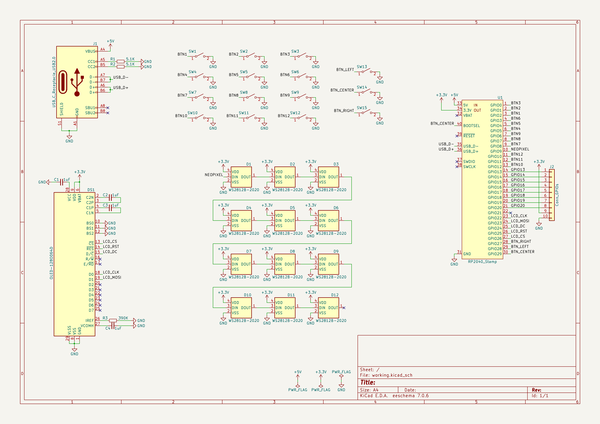
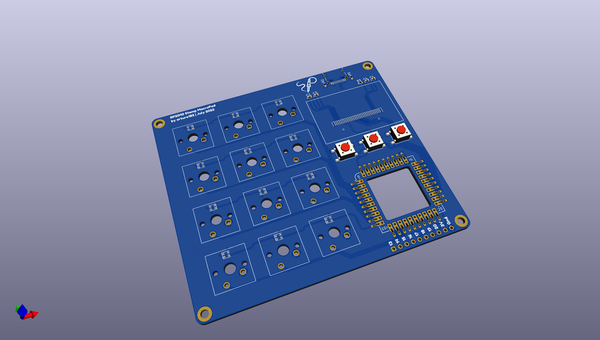
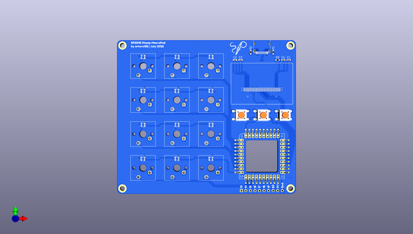
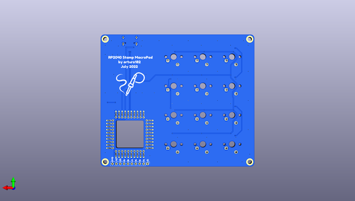

# rp2040_stamp_macropad_hw
 
## summary 
* id: solderparty_rp2040_stamp_macropad_hw_rp2040_stamp_macropad
* user: solderparty
* name: rp2040_stamp_macropad_hw
* board: rp2040_stamp_macropad
* repo: https://github.com/solderparty/rp2040_stamp_macropad_hw
* src_file_repo_kicad_pcb: rp2040_stamp_macropad.kicad_pcb
* src_file_repo_kicad_pcb_link: https://github.com/solderparty/rp2040_stamp_macropad_hw/tree/main/rp2040_stamp_macropad.kicad_pcb
* src_file_repo_kicad_sch: rp2040_stamp_macropad.kicad_sch
* src_file_repo_kicad_sch_link: https://github.com/solderparty/rp2040_stamp_macropad_hw/tree/main/rp2040_stamp_macropad.kicad_sch

* src_file_repo_sch: 
*
 src_file_repo_sch_link: https://github.com/solderparty/rp2040_stamp_macropad_hw/tree/main/
* full details link: https://github.com/oomlout/oomlout_oomp_project_bot_v_2/tree/main/projects/solderparty_rp2040_stamp_macropad_hw_rp2040_stamp_macropad/current_version/working  

## schematic  
  
[schematic (pdf)](working_schematic.pdf)  

## pcb  
 
  
  
  
[board (pdf)](working.pdf)  

## working_bom
| Id | Designator | Footprint | Quantity | Designation | Supplier and ref |  | None | 
| --- | --- | --- | --- | --- | --- | --- | --- | 
| 1 | C3,C4,C1,C2 | C_0603_1608Metric | 4 | 1uF |  |  | [''] | 
| 2 | D5,D8,D11,D2,D6,D7,D4,D10,D3,D1,D12,D9 | WS2812B-2020 | 12 | WS2812B-2020 |  |  | [''] | 
| 3 | SW1,SW4,SW10,SW2,SW6,SW12,SW8,SW11,SW5,SW7,SW9,SW3 | SW_Cherry_MX_1.00u_PCB | 12 | SW_SPST |  |  | [''] | 
| 4 | SW15 | SW_SPST_PTS645 | 1 | SW_RIGHT |  |  | [''] | 
| 5 | G*** | SolderParty-New-Logo_10x8.5mm_SilkScreen | 1 | LOGO |  |  | [''] | 
| 6 | R1,R2 | R_0603_1608Metric | 2 | 5.1K |  |  | [''] | 
| 7 | J1 | USB_C_Receptacle_HRO_TYPE-C-31-M-12 | 1 | USB_C_Receptacle_USB2.0 |  |  | [''] | 
| 8 | U1 | RP2040_Stamp_FlexyPin | 1 | RP2040_Stamp |  |  | [''] | 
| 9 | SW14 | SW_SPST_PTS645 | 1 | SW_CENTER |  |  | [''] | 
| 10 | DS1 | OLED-128O064D | 1 | OLED-128O064D |  |  | [''] | 
| 11 | SW13 | SW_SPST_PTS645 | 1 | SW_LEFT |  |  | [''] | 
| 12 | R3 | R_0603_1608Metric | 1 | 390K |  |  | [''] | 
| 13 | G*** | SolderParty-New-Logo_20x16.9mm_SilkScreen | 1 | LOGO |  |  | [''] | 
| 14 | J2 | PinHeader_1x10_P2.54mm_Vertical | 1 | Conn_GPIOs |  |  | [''] | 

## bom_schematic
| Ref | Qnty | Value | Cmp name | Footprint | Description | Vendor | DNP | 
| --- | --- | --- | --- | --- | --- | --- | --- | 
| C1, C2, C3, C4 | 4 | 1uF | C_Small | Capacitor_SMD:C_0603_1608Metric | Unpolarized capacitor, small symbol |  |  | 
| D1, D2, D3, D4, D5, D6, D7, D8, D9, D10, D11, D12 | 12 | WS2812B-2020 | WS2812B-2020 | LED_SMD_Extra:WS2812B-2020 |  |  |  | 
| DS1 | 1 | OLED-128O064D | OLED-128O064D | Display:OLED-128O064D | OLED display 128x64 |  |  | 
| J1 | 1 | USB_C_Receptacle_USB2.0 | USB_C_Receptacle_USB2.0 | Connector_USB:USB_C_Receptacle_HRO_TYPE-C-31-M-12 | USB 2.0-only Type-C Receptacle connector |  |  | 
| J2 | 1 | Conn_GPIOs | Conn_01x10 | Connector_PinHeader_2.54mm:PinHeader_1x10_P2.54mm_Vertical | Generic connector, single row, 01x10, script generated (kicad-library-utils/schlib/autogen/connector/) |  |  | 
| R1, R2 | 2 | 5.1K | R_Small | Resistor_SMD:R_0603_1608Metric | Resistor, small symbol |  |  | 
| R3 | 1 | 390K | R_Small | Resistor_SMD:R_0603_1608Metric | Resistor, small symbol |  |  | 
| SW1, SW2, SW3, SW4, SW5, SW6, SW7, SW8, SW9, SW10, SW11, SW12 | 12 | SW_SPST | SW_SPST | Button_Switch_Keyboard:SW_Cherry_MX_1.00u_PCB | Single Pole Single Throw (SPST) switch |  |  | 
| SW13 | 1 | SW_LEFT | SW_SPST | Button_Switch_SMD:SW_SPST_PTS645 | Single Pole Single Throw (SPST) switch |  |  | 
| SW14 | 1 | SW_CENTER | SW_SPST | Button_Switch_SMD:SW_SPST_PTS645 | Single Pole Single Throw (SPST) switch |  |  | 
| SW15 | 1 | SW_RIGHT | SW_SPST | Button_Switch_SMD:SW_SPST_PTS645 | Single Pole Single Throw (SPST) switch |  |  | 
| U1 | 1 | RP2040_Stamp | RP2040_Stamp | RP2040_Stamp:RP2040_Stamp_FlexyPin |  |  |  | 

