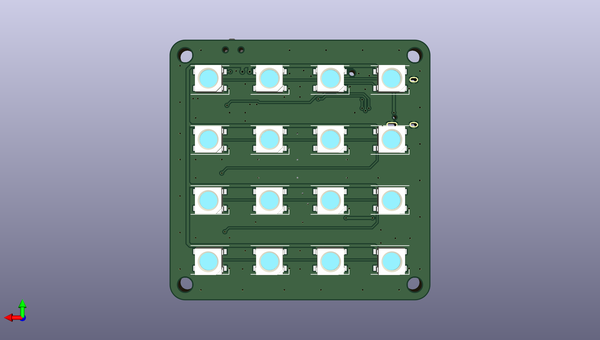

# rp2040_stamp_photolight_hw
 
## summary 
* id: solderparty_rp2040_stamp_photolight_hw_rp2040_stamp_photolight
* user: solderparty
* name: rp2040_stamp_photolight_hw
* board: rp2040_stamp_photolight
* repo: https://github.com/solderparty/rp2040_stamp_photolight_hw
* src_file_repo_kicad_pcb: rp2040_stamp_photolight.kicad_pcb
* src_file_repo_kicad_pcb_link: https://github.com/solderparty/rp2040_stamp_photolight_hw/tree/main/rp2040_stamp_photolight.kicad_pcb
* src_file_repo_kicad_sch: rp2040_stamp_photolight.kicad_sch
* src_file_repo_kicad_sch_link: https://github.com/solderparty/rp2040_stamp_photolight_hw/tree/main/rp2040_stamp_photolight.kicad_sch

* src_file_repo_sch: 
*
 src_file_repo_sch_link: https://github.com/solderparty/rp2040_stamp_photolight_hw/tree/main/
* full details link: https://github.com/oomlout/oomlout_oomp_project_bot_v_2/tree/main/projects/solderparty_rp2040_stamp_photolight_hw_rp2040_stamp_photolight/current_version/working  

## schematic  
  
[schematic (pdf)](working_schematic.pdf)  

## pcb  
 
  
  
  
[board (pdf)](working.pdf)  

## working_bom
| Id | Designator | Footprint | Quantity | Designation | Supplier and ref |  | None | 
| --- | --- | --- | --- | --- | --- | --- | --- | 
| 1 | J1 | USB_C_Receptacle_HRO_TYPE-C-31-M-12 | 1 | USB_C_Receptacle_USB2.0 |  |  | [''] | 
| 2 | G*** | SolderParty-New-Logo_12.5x10.6mm_SilkScreen | 1 | LOGO |  |  | [''] | 
| 3 | J2 | JST_SH_SM04B-SRSS-TB_1x04-1MP_P1.00mm_Horizontal | 1 | Conn_Qwiic |  |  | [''] | 
| 4 | Q1 | SOT-23 | 1 | BSS84 |  |  | [''] | 
| 5 | SW1 | SW_SPDT_PCM12 | 1 | SW_POWER |  |  | [''] | 
| 6 | U2 | MCPL3-AC-V | 1 | SW_Rocker |  |  | [''] | 
| 7 | R1,R2 | R_0603_1608Metric | 2 | 5.1K |  |  | [''] | 
| 8 | J3 | JST_PH_S2B-PH-SM4-TB_1x02-1MP_P2.00mm_Horizontal | 1 | Conn_Batt |  |  | [''] | 
| 9 | R3 | R_0603_1608Metric | 1 | 100K |  |  | [''] | 
| 10 | D17 | D_SOD-323 | 1 | D_Schottky_Small |  |  | [''] | 
| 11 | U1 | RP2040_Stamp_SMD | 1 | RP2040_Stamp |  |  | [''] | 
| 12 | D11,D4,D6,D2,D1,D16,D8,D7,D14,D9,D15,D12,D10,D5,D3,D13 | LED_WS2812B_PLCC4_5.0x5.0mm_P3.2mm | 16 | WS2812C |  |  | [''] | 

## bom_schematic
| Ref | Qnty | Value | Cmp name | Footprint | Description | Vendor | DNP | 
| --- | --- | --- | --- | --- | --- | --- | --- | 
| D1, D2, D3, D4, D5, D6, D7, D8, D9, D10, D11, D12, D13, D14, D15, D16 | 16 | WS2812C | WS2812B | LED_SMD:LED_WS2812B_PLCC4_5.0x5.0mm_P3.2mm | RGB LED with integrated controller |  |  | 
| D17 | 1 | D_Schottky_Small | D_Schottky_Small | Diode_SMD:D_SOD-323 | Schottky diode, small symbol |  |  | 
| J1 | 1 | USB_C_Receptacle_USB2.0 | USB_C_Receptacle_USB2.0 | Connector_USB:USB_C_Receptacle_HRO_TYPE-C-31-M-12 | USB 2.0-only Type-C Receptacle connector |  |  | 
| J2 | 1 | Conn_Qwiic | Conn_01x04 | Connector_JST:JST_SH_SM04B-SRSS-TB_1x04-1MP_P1.00mm_Horizontal | Generic connector, single row, 01x04, script generated (kicad-library-utils/schlib/autogen/connector/) |  |  | 
| J3 | 1 | Conn_Batt | Conn_01x02 | Connector_JST:JST_PH_S2B-PH-SM4-TB_1x02-1MP_P2.00mm_Horizontal | Generic connector, single row, 01x02, script generated (kicad-library-utils/schlib/autogen/connector/) |  |  | 
| Q1 | 1 | BSS84 | BSS84 | Package_TO_SOT_SMD:SOT-23 | -0.13A Id, -50V Vds, P-Channel MOSFET, SOT-23 |  |  | 
| R1, R2 | 2 | 5.1K | R_Small | Resistor_SMD:R_0603_1608Metric | Resistor, small symbol |  |  | 
| R3 | 1 | 100K | R_Small | Resistor_SMD:R_0603_1608Metric | Resistor, small symbol |  |  | 
| SW1 | 1 | SW_POWER | SW_SPDT | Button_Switch_SMD:SW_SPDT_PCM12 | Switch, single pole double throw |  |  | 
| U1 | 1 | RP2040_Stamp | RP2040_Stamp | RP2040_Stamp:RP2040_Stamp_SMD |  |  |  | 
| U2 | 1 | SW_Rocker | SW_SP3T_Rocker | Button_Switch_SMD_Extra:MCPL3-AC-V |  |  |  | 

