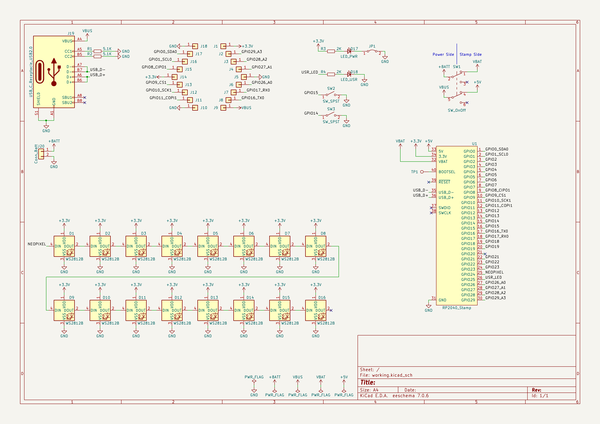
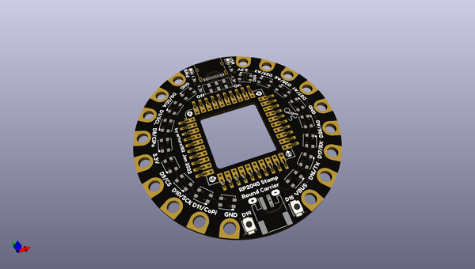
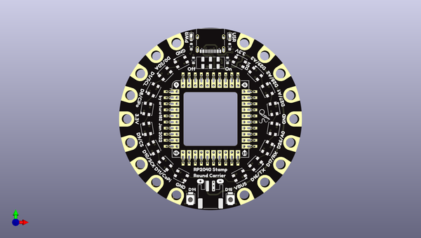
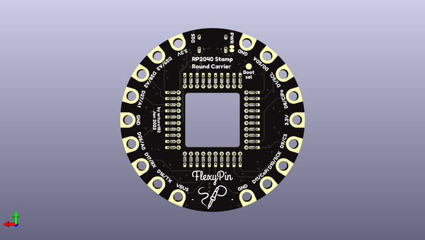

# rp2040_stamp_round_carrier_hw
 
## summary 
* id: solderparty_rp2040_stamp_round_carrier_hw_rp2040_stamp_round
* user: solderparty
* name: rp2040_stamp_round_carrier_hw
* board: rp2040_stamp_round
* repo: https://github.com/solderparty/rp2040_stamp_round_carrier_hw
* src_file_repo_kicad_pcb: rp2040_stamp_round.kicad_pcb
* src_file_repo_kicad_pcb_link: https://github.com/solderparty/rp2040_stamp_round_carrier_hw/tree/main/rp2040_stamp_round.kicad_pcb
* src_file_repo_kicad_sch: rp2040_stamp_round.kicad_sch
* src_file_repo_kicad_sch_link: https://github.com/solderparty/rp2040_stamp_round_carrier_hw/tree/main/rp2040_stamp_round.kicad_sch

* src_file_repo_sch: 
*
 src_file_repo_sch_link: https://github.com/solderparty/rp2040_stamp_round_carrier_hw/tree/main/
* full details link: https://github.com/oomlout/oomlout_oomp_project_bot_v_2/tree/main/projects/solderparty_rp2040_stamp_round_carrier_hw_rp2040_stamp_round/current_version/working  

## schematic  
  
[schematic (pdf)](working_schematic.pdf)  

## pcb  
 
  
  
  
[board (pdf)](working.pdf)  

## working_bom
| Id | Designator | Footprint | Quantity | Designation | Supplier and ref |  | None | 
| --- | --- | --- | --- | --- | --- | --- | --- | 
| 1 | D13,D15,D4,D1,D2,D11,D12,D8,D3,D9,D6,D5,D7,D16,D10,D14 | LED_WS2812B_PLCC4_3.5x3.5mm_P1.78mm | 16 | WS2812B |  |  | [''] | 
| 2 | SW1 | SW_DPDT_CK_JS202011JCQN | 1 | SW_OnOff |  |  | [''] | 
| 3 | U1 | RP2040_Stamp_Springs | 1 | RP2040_Stamp |  |  | [''] | 
| 4 | R1,R2 | R_0603_1608Metric | 2 | 5.1K |  |  | [''] | 
| 5 | SW3,SW2 | SW_SPST_B3U-1000P-B | 2 | SW_SPST |  |  | [''] | 
| 6 | J20 | JST_PH_S2B-PH-SM4-TB_1x02-1MP_P2.00mm_Horizontal | 1 | Conn_Batt |  |  | [''] | 
| 7 | G*** | SolderParty-New-Logo_5x4.2mm_SilkScreen | 1 | LOGO |  |  | [''] | 
| 8 | R4,R3 | R_0603_1608Metric | 2 | 2K |  |  | [''] | 
| 9 | D17 | LED_0603_1608Metric | 1 | LED_PWR |  |  | [''] | 
| 10 | J19 | USB_C_Receptacle_XKB_U262-16XN-4BVC11 | 1 | USB_C_Receptacle_USB2.0 |  |  | [''] | 
| 11 | D18 | LED_0603_1608Metric | 1 | LED_USR |  |  | [''] | 
| 12 | G*** | SolderParty-New-Logo_10x8.5mm_SilkScreen | 1 | LOGO |  |  | [''] | 

## bom_schematic
| Ref | Qnty | Value | Cmp name | Footprint | Description | Vendor | DNP | 
| --- | --- | --- | --- | --- | --- | --- | --- | 
| D1, D2, D3, D4, D5, D6, D7, D8, D9, D10, D11, D12, D13, D14, D15, D16 | 16 | WS2812B | WS2812B | LED_SMD_Extra:LED_WS2812B_PLCC4_3.5x3.5mm_P1.78mm | RGB LED with integrated controller |  |  | 
| D17 | 1 | LED_PWR | LED_Small | LED_SMD:LED_0603_1608Metric | Light emitting diode, small symbol |  |  | 
| D18 | 1 | LED_USR | LED_Small | LED_SMD:LED_0603_1608Metric | Light emitting diode, small symbol |  |  | 
| J19 | 1 | USB_C_Receptacle_USB2.0 | USB_C_Receptacle_USB2.0 | Connector_USB:USB_C_Receptacle_XKB_U262-16XN-4BVC11 | USB 2.0-only Type-C Receptacle connector |  |  | 
| J20 | 1 | Conn_Batt | Conn_01x02 | Connector_JST:JST_PH_S2B-PH-SM4-TB_1x02-1MP_P2.00mm_Horizontal | Generic connector, single row, 01x02, script generated (kicad-library-utils/schlib/autogen/connector/) |  |  | 
| R1, R2 | 2 | 5.1K | R_Small | Resistor_SMD:R_0603_1608Metric | Resistor, small symbol |  |  | 
| R3, R4 | 2 | 2K | R_Small | Resistor_SMD:R_0603_1608Metric | Resistor, small symbol |  |  | 
| SW1 | 1 | SW_OnOff | SW_Push_DPDT | Button_Switch_SMD:SW_DPDT_CK_JS202011JCQN | Momentary Switch, dual pole double throw |  |  | 
| SW2, SW3 | 2 | SW_SPST | SW_SPST | Button_Switch_SMD:SW_SPST_B3U-1000P-B | Single Pole Single Throw (SPST) switch |  |  | 
| U1 | 1 | RP2040_Stamp | RP2040_Stamp | RP2040_Stamp:RP2040_Stamp_Springs |  |  |  | 

