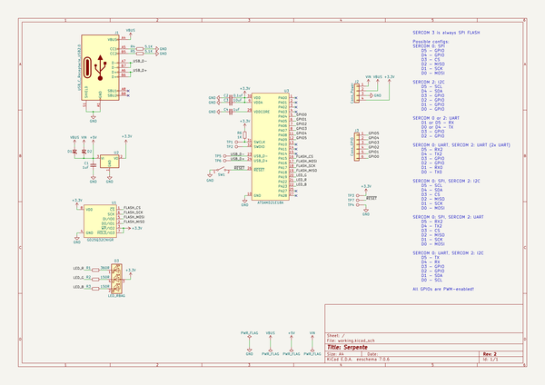
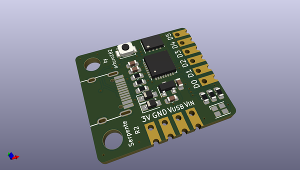
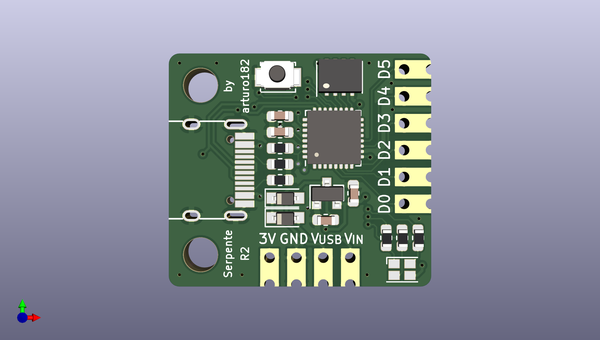
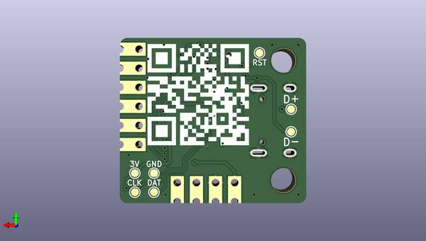

# serpente_hw
 
## summary 
* id: solderparty_serpente_hw_serpente
* user: solderparty
* name: serpente_hw
* board: serpente
* repo: https://github.com/solderparty/serpente_hw
* src_file_repo_kicad_pcb: serpente.kicad_pcb
* src_file_repo_kicad_pcb_link: https://github.com/solderparty/serpente_hw/tree/master/serpente.kicad_pcb

* src_file_repo_sch: serpente.sch
*
 src_file_repo_sch_link: https://github.com/solderparty/serpente_hw/tree/master/serpente.sch
* full details link: https://github.com/oomlout/oomlout_oomp_project_bot_v_2/tree/main/projects/solderparty_serpente_hw_serpente/current_version/working  

## schematic  
  
[schematic (pdf)](working_schematic.pdf)  

## pcb  
 
  
  
  
[board (pdf)](working.pdf)  

## working_bom
| Id | Designator | Footprint | Quantity | Designation | Supplier and ref |  | None | 
| --- | --- | --- | --- | --- | --- | --- | --- | 
| 1 | C1,C4 | C_0603_1608Metric | 2 | 1uF |  |  | [''] | 
| 2 | D1,D2 | D_SOD-323_HandSoldering | 2 | D_Schottky_Small |  |  | [''] | 
| 3 | J1 | USB_C_Receptacle_GT-USB-7010 | 1 | USB_C_Receptacle_USB2.0 |  |  | [''] | 
| 4 | R1 | R_0603_1608Metric | 1 | 360R |  |  | [''] | 
| 5 | R2,R3 | R_0603_1608Metric | 2 | 150R |  |  | [''] | 
| 6 | R4,R5 | R_0603_1608Metric | 2 | 5.1K |  |  | [''] | 
| 7 | R6 | R_0603_1608Metric | 1 | 1K |  |  | [''] | 
| 8 | SW1 | SW_SPST_B3U-1000P-B | 1 | SW_RESET |  |  | [''] | 
| 9 | U1 | USON-8_3x4mm_P0.8mm | 1 | GD25Q32CNIGR |  |  | [''] | 
| 10 | U2 | SOT-23 | 1 | MCP1700-3302E_SOT23 |  |  | [''] | 
| 11 | C2 | C_0603_1608Metric | 1 | 0.1uF |  |  | [''] | 
| 12 | C3 | C_0603_1608Metric | 1 | 10uF |  |  | [''] | 
| 13 | U3 | QFN-32-1EP_5x5mm_P0.5mm_EP3.6x3.6mm | 1 | ATSAMD21E18A |  |  | [''] | 
| 14 | D3 | LED_Cree-PLCC4_2x2mm_CW | 1 | LED_RBAG |  |  | [''] | 
| 15 | J3 | PinHeader_1x06_P2.54mm_Vertical_Castellated | 1 | Conn_GPIO |  |  | [''] | 
| 16 | J2 | PinHeader_1x04_P2.54mm_Vertical_Castellated | 1 | Conn_Power |  |  | [''] | 

## bom_schematic
| Ref | Qnty | Value | Cmp name | Footprint | Description | Vendor | DNP | 
| --- | --- | --- | --- | --- | --- | --- | --- | 
| C1, C4 | 2 | 1uF | C_Small | Capacitor_SMD:C_0603_1608Metric | Unpolarized capacitor, small symbol |  |  | 
| C2 | 1 | 0.1uF | C_Small | Capacitor_SMD:C_0603_1608Metric | Unpolarized capacitor, small symbol |  |  | 
| C3 | 1 | 10uF | C_Small | Capacitor_SMD:C_0603_1608Metric | Unpolarized capacitor, small symbol |  |  | 
| D1, D2 | 2 | D_Schottky_Small | D_Schottky_Small | Diode_SMD:D_SOD-323_HandSoldering | Schottky diode, small symbol |  |  | 
| D3 | 1 | LED_RBAG | LED_RBAG-Device_Extra | LED_SMD:LED_Cree-PLCC4_2x2mm_CW |  |  |  | 
| J1 | 1 | USB_C_Receptacle_USB2.0 | USB_C_Receptacle_USB2.0-Connector | Connector_USB_Extra:USB_C_Receptacle_GT-USB-7010 |  |  |  | 
| J2 | 1 | Conn_Power | Conn_01x04 | Connector_PinHeader_2.54mm_Extra:PinHeader_1x04_P2.54mm_Vertical_Castellated | Generic connector, single row, 01x04, script generated (kicad-library-utils/schlib/autogen/connector/) |  |  | 
| J3 | 1 | Conn_GPIO | Conn_01x06 | Connector_PinHeader_2.54mm_Extra:PinHeader_1x06_P2.54mm_Vertical_Castellated | Generic connector, single row, 01x06, script generated (kicad-library-utils/schlib/autogen/connector/) |  |  | 
| R1 | 1 | 360R | R_Small | Resistor_SMD:R_0603_1608Metric | Resistor, small symbol |  |  | 
| R2, R3 | 2 | 150R | R_Small | Resistor_SMD:R_0603_1608Metric | Resistor, small symbol |  |  | 
| R4, R5 | 2 | 5.1K | R_Small | Resistor_SMD:R_0603_1608Metric | Resistor, small symbol |  |  | 
| R6 | 1 | 1K | R_Small | Resistor_SMD:R_0603_1608Metric | Resistor, small symbol |  |  | 
| SW1 | 1 | SW_RESET | SW_SPST | Button_Switch_SMD:SW_SPST_B3U-1000P-B | Single Pole Single Throw (SPST) switch |  |  | 
| TP1 | 1 | TP_SWCLK | TestPoint | TestPoint:TestPoint_Pad_D1.0mm | test point |  |  | 
| TP2 | 1 | TP_SWDIO | TestPoint | TestPoint:TestPoint_Pad_D1.0mm | test point |  |  | 
| TP3 | 1 | TP_VDD | TestPoint | TestPoint:TestPoint_Pad_D1.0mm | test point |  |  | 
| TP4 | 1 | TP_GND | TestPoint | TestPoint:TestPoint_Pad_D1.0mm | test point |  |  | 
| TP5 | 1 | TP_USB_D- | TestPoint | TestPoint:TestPoint_Pad_D1.0mm | test point |  |  | 
| TP6 | 1 | TP_USB_D+ | TestPoint | TestPoint:TestPoint_Pad_D1.0mm | test point |  |  | 
| TP7 | 1 | TP_RESET | TestPoint | TestPoint:TestPoint_Pad_D1.0mm | test point |  |  | 
| U1 | 1 | GD25Q32CNIGR | GD25Q32C-Memory_Flash_Extra | Package_SON_Extra:USON-8_3x4mm_P0.8mm |  |  |  | 
| U2 | 1 | MCP1700-3302E_SOT23 | MCP1700-3302E_SOT23-Regulator_Linear | Package_TO_SOT_SMD:SOT-23 |  |  |  | 
| U3 | 1 | ATSAMD21E18A | ATSAMD21E1xA-MCU_Microchip_SAMD_Extra | Package_DFN_QFN:QFN-32-1EP_5x5mm_P0.5mm_EP3.6x3.6mm |  |  |  | 

