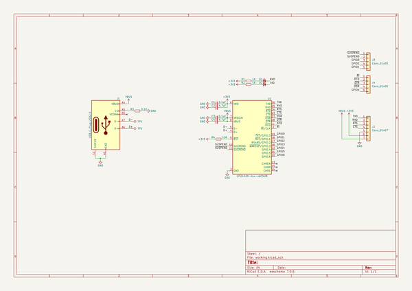
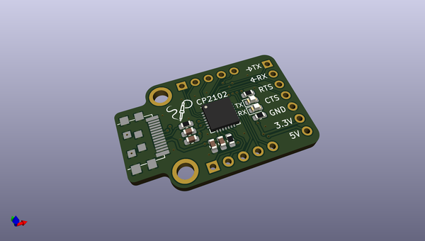
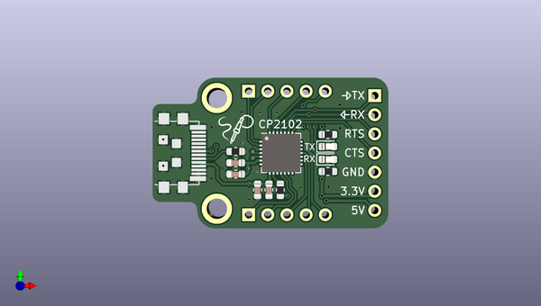
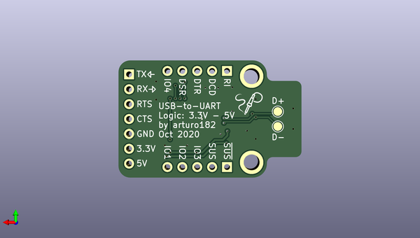

# type_c_plug_cp2102
 
## summary 
* id: solderparty_type_c_plug_cp2102_type_c_plug_cp2102
* user: solderparty
* name: type_c_plug_cp2102
* board: type_c_plug_cp2102
* repo: https://github.com/solderparty/type-c_plug_cp2102
* src_file_repo_kicad_pcb: type-c_plug_cp2102.kicad_pcb
* src_file_repo_kicad_pcb_link: https://github.com/solderparty/type-c_plug_cp2102/tree/main/type-c_plug_cp2102.kicad_pcb
* src_file_repo_kicad_sch: type-c_plug_cp2102.kicad_sch
* src_file_repo_kicad_sch_link: https://github.com/solderparty/type-c_plug_cp2102/tree/main/type-c_plug_cp2102.kicad_sch

* src_file_repo_sch: 
*
 src_file_repo_sch_link: https://github.com/solderparty/type-c_plug_cp2102/tree/main/
* full details link: https://github.com/oomlout/oomlout_oomp_project_bot_v_2/tree/main/projects/solderparty_type_c_plug_cp2102_type_c_plug_cp2102/current_version/working  

## schematic  
  
[schematic (pdf)](working_schematic.pdf)  

## pcb  
 
  
  
  
[board (pdf)](working.pdf)  

## working_bom
| Id | Designator | Footprint | Quantity | Designation | Supplier and ref |  | None | 
| --- | --- | --- | --- | --- | --- | --- | --- | 
| 1 | C1,C3 | C_0603_1608Metric | 2 | 0.1uF |  |  | [''] | 
| 2 | D1 | LED_0603_1608Metric | 1 | LED_RXD |  |  | [''] | 
| 3 | C4,C2 | C_0603_1608Metric | 2 | 4.7uF |  |  | [''] | 
| 4 | U1 | QFN-28-1EP_5x5mm_P0.5mm_EP3.35x3.35mm | 1 | CP2102N-Axx-xQFN28 |  |  | [''] | 
| 5 | R4 | R_0603_1608Metric | 1 | 10K |  |  | [''] | 
| 6 | J1 | USB_C_Plug_UTC009-C12 | 1 | USB_C_Plug_USB2.0 |  |  | [''] | 
| 7 | D2 | LED_0603_1608Metric | 1 | LED_TXD |  |  | [''] | 
| 8 | G***,G*** | SolderParty-New-Logo_5x4.2mm_SilkScreen | 2 | LOGO |  |  | [''] | 
| 9 | J2 | PinHeader_1x07_P2.54mm_Vertical | 1 | Conn_01x07 |  |  | [''] | 
| 10 | R3 | R_0603_1608Metric | 1 | 5.1K |  |  | [''] | 
| 11 | R1,R2 | R_0603_1608Metric | 2 | 1K |  |  | [''] | 
| 12 | J4,J3 | PinHeader_1x05_P2.54mm_Vertical | 2 | Conn_01x05 |  |  | [''] | 
| 13 | TP2 | TestPoint_Pad_D1.5mm | 1 | TP_D+ |  |  | [''] | 
| 14 | TP1 | TestPoint_Pad_D1.5mm | 1 | TP_D- |  |  | [''] | 

## bom_schematic
| Ref | Qnty | Value | Cmp name | Footprint | Description | Vendor | DNP | 
| --- | --- | --- | --- | --- | --- | --- | --- | 
| C1, C3 | 2 | 0.1uF | C_Small | Capacitor_SMD:C_0603_1608Metric | Unpolarized capacitor, small symbol |  |  | 
| C2, C4 | 2 | 4.7uF | C_Small | Capacitor_SMD:C_0603_1608Metric | Unpolarized capacitor, small symbol |  |  | 
| D1 | 1 | LED_RXD | LED_Small | LED_SMD:LED_0603_1608Metric | Light emitting diode, small symbol |  |  | 
| D2 | 1 | LED_TXD | LED_Small | LED_SMD:LED_0603_1608Metric | Light emitting diode, small symbol |  |  | 
| J1 | 1 | USB_C_Plug_USB2.0 | USB_C_Plug_USB2.0 | Connector_USB_Extra:USB_C_Plug_UTC009-C12 | USB 2.0-only Type-C Plug connector |  |  | 
| J2 | 1 | Conn_01x07 | Conn_01x07 | Connector_PinHeader_2.54mm:PinHeader_1x07_P2.54mm_Vertical | Generic connector, single row, 01x07, script generated (kicad-library-utils/schlib/autogen/connector/) |  |  | 
| J3, J4 | 2 | Conn_01x05 | Conn_01x05 | Connector_PinHeader_2.54mm:PinHeader_1x05_P2.54mm_Vertical | Generic connector, single row, 01x05, script generated (kicad-library-utils/schlib/autogen/connector/) |  |  | 
| R1, R2 | 2 | 1K | R_Small | Resistor_SMD:R_0603_1608Metric | Resistor, small symbol |  |  | 
| R3 | 1 | 5.1K | R_Small | Resistor_SMD:R_0603_1608Metric | Resistor, small symbol |  |  | 
| R4 | 1 | 10K | R_Small | Resistor_SMD:R_0603_1608Metric | Resistor, small symbol |  |  | 
| TP1 | 1 | TP_D- | TestPoint | TestPoint:TestPoint_Pad_D1.5mm | test point |  |  | 
| TP2 | 1 | TP_D+ | TestPoint | TestPoint:TestPoint_Pad_D1.5mm | test point |  |  | 
| U1 | 1 | CP2102N-Axx-xQFN28 | CP2102N-Axx-xQFN28 | Package_DFN_QFN:QFN-28-1EP_5x5mm_P0.5mm_EP3.35x3.35mm | USB to UART master bridge, QFN-28 |  |  | 

