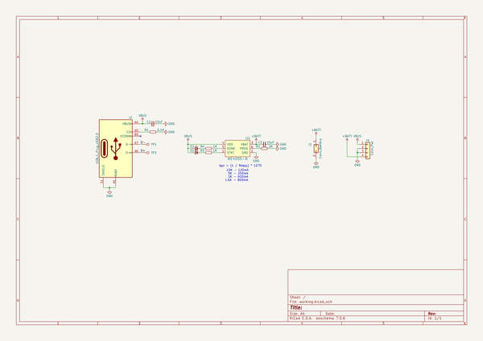
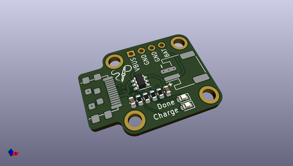
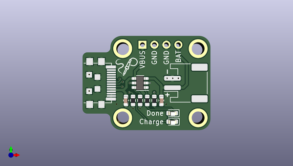
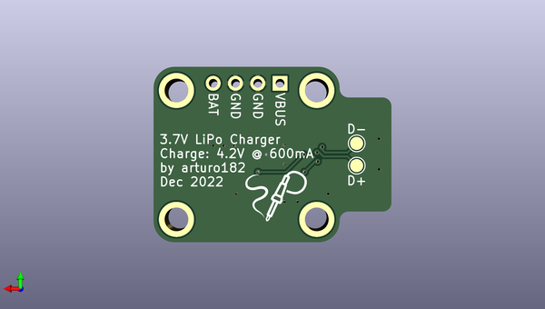

# type_c_plug_lipo
 
## summary 
* id: solderparty_type_c_plug_lipo_type_c_plug_lipo
* user: solderparty
* name: type_c_plug_lipo
* board: type_c_plug_lipo
* repo: https://github.com/solderparty/type-c_plug_lipo
* src_file_repo_kicad_pcb: type-c_plug_lipo.kicad_pcb
* src_file_repo_kicad_pcb_link: https://github.com/solderparty/type-c_plug_lipo/tree/rev2/type-c_plug_lipo.kicad_pcb
* src_file_repo_kicad_sch: type-c_plug_lipo.kicad_sch
* src_file_repo_kicad_sch_link: https://github.com/solderparty/type-c_plug_lipo/tree/rev2/type-c_plug_lipo.kicad_sch

* src_file_repo_sch: 
*
 src_file_repo_sch_link: https://github.com/solderparty/type-c_plug_lipo/tree/rev2/
* full details link: https://github.com/oomlout/oomlout_oomp_project_bot_v_2/tree/main/projects/solderparty_type_c_plug_lipo_type_c_plug_lipo/current_version/working  

## schematic  
  
[schematic (pdf)](working_schematic.pdf)  

## pcb  
 
  
  
  
[board (pdf)](working.pdf)  

## working_bom
| Id | Designator | Footprint | Quantity | Designation | Supplier and ref |  | None | 
| --- | --- | --- | --- | --- | --- | --- | --- | 
| 1 | R1 | R_0603_1608Metric | 1 | 5.1K |  |  | [''] | 
| 2 | C2,C1 | C_0603_1608Metric | 2 | 10uF |  |  | [''] | 
| 3 | J4 | PinHeader_1x04_P2.54mm_Vertical | 1 | Conn_Pwr |  |  | [''] | 
| 4 | R4,R3 | R_0603_1608Metric | 2 | 1K |  |  | [''] | 
| 5 | D2 | LED_0603_1608Metric | 1 | LED_DONE |  |  | [''] | 
| 6 | J2 | USB_C_Plug_UTC009-C12 | 1 | USB_C_Plug_USB2.0 |  |  | [''] | 
| 7 | G*** | SolderParty-New-Logo_5x4.2mm_SilkScreen | 1 | LOGO |  |  | [''] | 
| 8 | D1 | LED_0603_1608Metric | 1 | LED_CHR |  |  | [''] | 
| 9 | J1 | JST_PH_S2B-PH-SM4-TB_1x02-1MP_P2.00mm_Horizontal | 1 | Conn_Battery |  |  | [''] | 
| 10 | R2 | R_0603_1608Metric | 1 | 2K |  |  | [''] | 
| 11 | U1 | SOT-23-6 | 1 | ME4055-N |  |  | [''] | 
| 12 | G*** | SolderParty-New-Logo_7.5x6.4mm_SilkScreen | 1 | LOGO |  |  | [''] | 
| 13 | TP2 | TestPoint_Pad_D1.5mm | 1 | TP_D+ |  |  | [''] | 
| 14 | TP1 | TestPoint_Pad_D1.5mm | 1 | TP_D- |  |  | [''] | 

## bom_schematic
| Ref | Qnty | Value | Cmp name | Footprint | Description | Vendor | DNP | 
| --- | --- | --- | --- | --- | --- | --- | --- | 
| C1, C2 | 2 | 10uF | C_Small | Capacitor_SMD:C_0603_1608Metric | Unpolarized capacitor, small symbol |  |  | 
| D1 | 1 | LED_CHR | LED_Small | LED_SMD:LED_0603_1608Metric | Light emitting diode, small symbol |  |  | 
| D2 | 1 | LED_DONE | LED_Small | LED_SMD:LED_0603_1608Metric | Light emitting diode, small symbol |  |  | 
| J1 | 1 | Conn_Battery | Conn_02x01 | Connector_JST:JST_PH_S2B-PH-SM4-TB_1x02-1MP_P2.00mm_Horizontal | Generic connector, double row, 02x01, this symbol is compatible with counter-clockwise, top-bottom and odd-even numbering schemes., script generated (kicad-library-utils/schlib/autogen/connector/) |  |  | 
| J2 | 1 | USB_C_Plug_USB2.0 | USB_C_Plug_USB2.0 | Connector_USB_Extra:USB_C_Plug_UTC009-C12 | USB 2.0-only Type-C Plug connector |  |  | 
| J4 | 1 | Conn_Pwr | Conn_01x04 | Connector_PinHeader_2.54mm:PinHeader_1x04_P2.54mm_Vertical | Generic connector, single row, 01x04, script generated (kicad-library-utils/schlib/autogen/connector/) |  |  | 
| R1 | 1 | 5.1K | R_Small | Resistor_SMD:R_0603_1608Metric | Resistor, small symbol |  |  | 
| R2 | 1 | 2K | R_Small | Resistor_SMD:R_0603_1608Metric | Resistor, small symbol |  |  | 
| R3, R4 | 2 | 1K | R_Small | Resistor_SMD:R_0603_1608Metric | Resistor, small symbol |  |  | 
| TP1 | 1 | TP_D- | TestPoint | TestPoint:TestPoint_Pad_D1.5mm | test point |  |  | 
| TP2 | 1 | TP_D+ | TestPoint | TestPoint:TestPoint_Pad_D1.5mm | test point |  |  | 
| U1 | 1 | ME4055-N | ME4055-N | Package_TO_SOT_SMD:SOT-23-6 |  |  |  | 

