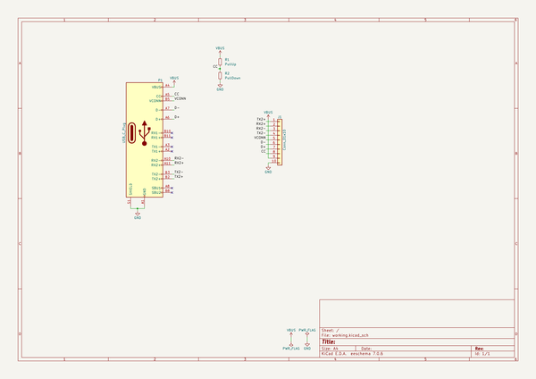
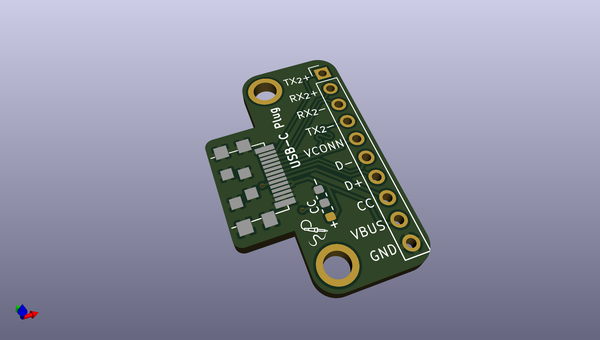
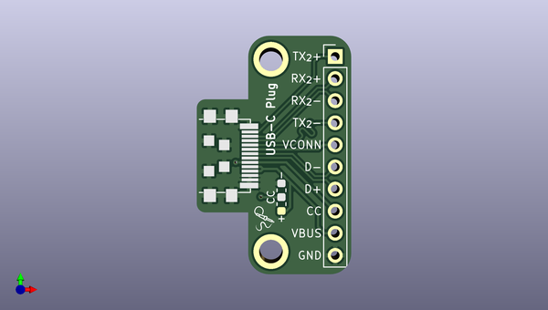
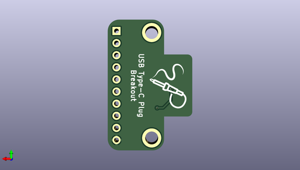

# usb_c_plug_breakout
 
## summary 
* id: solderparty_usb_c_plug_breakout_type_c_plug_breakout_small
* user: solderparty
* name: usb_c_plug_breakout
* board: type_c_plug_breakout_small
* repo: https://github.com/solderparty/usb_c_plug_breakout
* src_file_repo_kicad_pcb: type-c_plug_breakout.kicad_pcb
* src_file_repo_kicad_pcb_link: https://github.com/solderparty/usb_c_plug_breakout/tree/main/type-c_plug_breakout.kicad_pcb
* src_file_repo_kicad_sch: type-c_plug_breakout.kicad_sch
* src_file_repo_kicad_sch_link: https://github.com/solderparty/usb_c_plug_breakout/tree/main/type-c_plug_breakout.kicad_sch

* src_file_repo_sch: 
*
 src_file_repo_sch_link: https://github.com/solderparty/usb_c_plug_breakout/tree/main/
* full details link: https://github.com/oomlout/oomlout_oomp_project_bot_v_2/tree/main/projects/solderparty_usb_c_plug_breakout_type_c_plug_breakout_small/current_version/working  

## schematic  
  
[schematic (pdf)](working_schematic.pdf)  

## pcb  
 
  
  
  
[board (pdf)](working.pdf)  

## working_bom
| Id | Designator | Footprint | Quantity | Designation | Supplier and ref |  | None | 
| --- | --- | --- | --- | --- | --- | --- | --- | 
| 1 | P1 | USB_C_Plug_UTC009-C12 | 1 | USB_C_Plug |  |  | [''] | 
| 2 | R2 | R_0603_1608Metric | 1 | PullDown |  |  | [''] | 
| 3 | R1 | R_0603_1608Metric | 1 | PullUp |  |  | [''] | 
| 4 | G*** | SolderParty-New-Logo_3x2.5mm_SilkScreen | 1 | LOGO |  |  | [''] | 
| 5 | J1 | PinHeader_1x10_P2.54mm_Vertical | 1 | Conn_01x10 |  |  | [''] | 
| 6 | G*** | SolderParty-New-Logo_10x8.5mm_SilkScreen | 1 | LOGO |  |  | [''] | 

## bom_schematic
| Ref | Qnty | Value | Cmp name | Footprint | Description | Vendor | DNP | 
| --- | --- | --- | --- | --- | --- | --- | --- | 
| J1 | 1 | Conn_01x10 | Conn_01x10 | Connector_PinHeader_2.54mm:PinHeader_1x10_P2.54mm_Vertical | Generic connector, single row, 01x10, script generated (kicad-library-utils/schlib/autogen/connector/) |  |  | 
| P1 | 1 | USB_C_Plug | USB_C_Plug | Connector_USB_Extra:USB_C_Plug_UTC009-C12 | USB Type-C Plug connector |  |  | 
| R1 | 1 | PullUp | R_Small | Resistor_SMD:R_0603_1608Metric | Resistor, small symbol |  |  | 
| R2 | 1 | PullDown | R_Small | Resistor_SMD:R_0603_1608Metric | Resistor, small symbol |  |  | 

