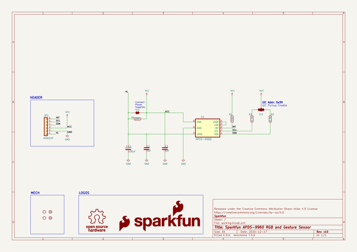
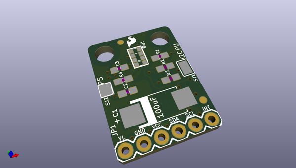
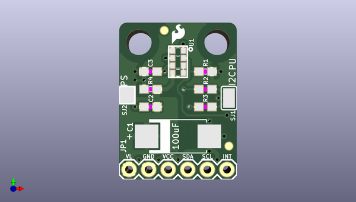
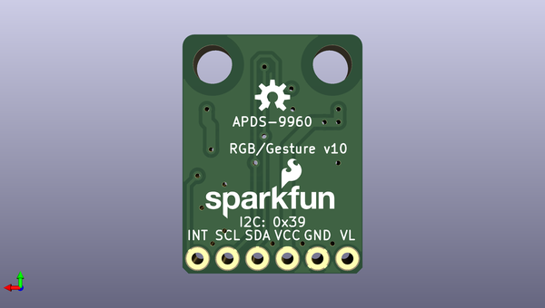

# apds_9960_rgb_and_gesture_sensor
 
## summary 
* id: sparkfun_apds_9960_rgb_and_gesture_sensor_sparkfun_apds_9960_rgb_and_gesture_sensor
* user: sparkfun
* name: apds_9960_rgb_and_gesture_sensor
* board: sparkfun_apds_9960_rgb_and_gesture_sensor
* repo: https://github.com/sparkfun/APDS-9960_RGB_and_Gesture_Sensor
* src_file_repo_kicad_pcb: Hardware/Kicad/SparkFun_APDS-9960_RGB_and_Gesture_Sensor.kicad_pcb
* src_file_repo_kicad_pcb_link: https://github.com/sparkfun/APDS-9960_RGB_and_Gesture_Sensor/tree/master/Hardware/Kicad/SparkFun_APDS-9960_RGB_and_Gesture_Sensor.kicad_pcb

* src_file_repo_sch: Hardware/Kicad/SparkFun_APDS-9960_RGB_and_Gesture_Sensor.sch
*
 src_file_repo_sch_link: https://github.com/sparkfun/APDS-9960_RGB_and_Gesture_Sensor/tree/master/Hardware/Kicad/SparkFun_APDS-9960_RGB_and_Gesture_Sensor.sch
* full details link: https://github.com/oomlout/oomlout_oomp_project_bot_v_2/tree/main/projects/sparkfun_apds_9960_rgb_and_gesture_sensor_sparkfun_apds_9960_rgb_and_gesture_sensor/current_version/working  

## schematic  
  
[schematic (pdf)](working_schematic.pdf)  

## pcb  
 
  
  
  
[board (pdf)](working.pdf)  

## working_bom
| Id | Designator | Footprint | Quantity | Designation | Supplier and ref |  | None | 
| --- | --- | --- | --- | --- | --- | --- | --- | 
| 1 | C1 | c_2917 | 1 | 100uF |  |  | [''] | 
| 2 | C3,C2 | 0603-CAP | 2 | 1uF |  |  | [''] | 
| 3 | FID1,FID2 | FIDUCIAL-1X2 | 2 | FIDUCIAL1X2 |  |  | [''] | 
| 4 | JP1 | 1X06 | 1 | M06SIP |  |  | [''] | 
| 5 | R1 | 0603-RES | 1 | 10k |  |  | [''] | 
| 6 | R4 | 0603-RES | 1 | DNP |  |  | [''] | 
| 7 | STANDOFF1,STANDOFF2 | STAND-OFF | 2 | STAND-OFF |  |  | [''] | 
| 8 | U1 | APDS-9960 | 1 | APDS-9960 |  |  | [''] | 
| 9 | U$1 | SFE_LOGO_FLAME_.1 | 1 | SFE_LOGO_NAME_FLAME.1_INCH |  |  | [''] | 
| 10 | R2,R3 | 0603 | 2 | 4.7k |  |  | [''] | 
| 11 | SJ2 | SJ_2S | 1 | SOLDERJUMPERNC |  |  | [''] | 
| 12 | SJ1 | SJ_3_PASTE1&2&3 | 1 | SOLDERJUMPER_2WAYPASTE1&2&3 |  |  | [''] | 
| 13 | LOGO1 | SFE_LOGO_NAME_FLAME_.1 | 1 | SFE_LOGO_FLAME.1_INCH |  |  | [''] | 
| 14 | LOGO2 | OSHW-LOGO-S | 1 | OSHW-LOGOS |  |  | [''] | 

## bom_schematic
| Ref | Qnty | Value | Cmp name | Footprint | Description | Vendor | DNP | 
| --- | --- | --- | --- | --- | --- | --- | --- | 
| C1 | 1 | 100uF | Cap_Pol | APDS_9960:c_2917 | Polarized capacitor |  |  | 
| C2, C3 | 2 | 1uF | Cap_NonPol | APDS_9960:0603-CAP | Polarized capacitor |  |  | 
| FID1, FID2 | 2 | FIDUCIAL1X2 | FIDUCIAL1X2 | APDS_9960:FIDUCIAL-1X2 |  |  |  | 
| JP1 | 1 | M06SIP | Conn_01x06 | APDS_9960:1X06 | Generic connector, single row, 01x06, script generated (kicad-library-utils/schlib/autogen/connector/) |  |  | 
| LOGO1 | 1 | SFE_LOGO_FLAME.1_INCH | SFE_LOGO_FLAME.1COP | APDS_9960:SFE_LOGO_NAME_FLAME_.1 |  |  |  | 
| LOGO2 | 1 | OSHW-LOGOS | OSHW | APDS_9960:OSHW-LOGO-S |  |  |  | 
| R1 | 1 | 10k | Resistor | APDS_9960:0603-RES | Resistor |  |  | 
| R2, R3 | 2 | 4.7k | Resistor | APDS_9960:0603 | Resistor |  |  | 
| R4 | 1 | DNP | Resistor | APDS_9960:0603-RES | Resistor |  |  | 
| SJ1 | 1 | SOLDERJUMPER_2WAYPASTE1&2&3 | SOLDERJUMPER_2WAYPASTE1&2&3 | APDS_9960:SJ_3_PASTE1&2&3 |  |  |  | 
| SJ2 | 1 | SOLDERJUMPERNC | SOLDERJUMPERNO | APDS_9960:SJ_2S |  |  |  | 
| STANDOFF1, STANDOFF2 | 2 | STAND-OFF | STAND-OFF | APDS_9960:STAND-OFF |  |  |  | 
| U1 | 1 | APDS-9960 | APDS-9960 | APDS_9960:APDS-9960 |  |  |  | 
| U$1 | 1 | SFE_LOGO_NAME_FLAME.1_INCH | SFE_LOGO_NAME_FLAME1_INCH | APDS_9960:SFE_LOGO_FLAME_.1 |  |  |  | 

