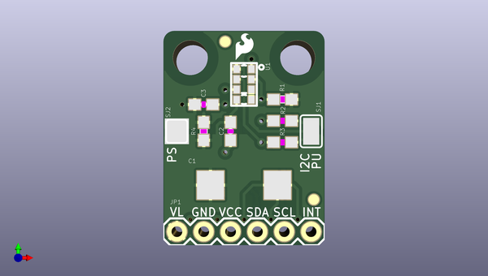

# apds_9960_rgb_and_gesture_sensor
 
## summary 
* id: sparkfun_apds_9960_rgb_and_gesture_sensor_sparkfun_apds_9960_rgb_and_gesture_sensor_2
* user: sparkfun
* name: apds_9960_rgb_and_gesture_sensor
* board: sparkfun_apds_9960_rgb_and_gesture_sensor_2
* repo: https://github.com/sparkfun/APDS-9960_RGB_and_Gesture_Sensor
* src_file_repo_kicad_pcb: Hardware/Kicad/archive/SparkFun_APDS-9960_RGB_and_Gesture_Sensor_2.kicad_pcb
* src_file_repo_kicad_pcb_link: https://github.com/sparkfun/APDS-9960_RGB_and_Gesture_Sensor/tree/master/Hardware/Kicad/archive/SparkFun_APDS-9960_RGB_and_Gesture_Sensor_2.kicad_pcb

* src_file_repo_sch: Hardware/Kicad/SparkFun_APDS-9960_RGB_and_Gesture_Sensor.sch
*
 src_file_repo_sch_link: https://github.com/sparkfun/APDS-9960_RGB_and_Gesture_Sensor/tree/master/Hardware/Kicad/SparkFun_APDS-9960_RGB_and_Gesture_Sensor.sch
* full details link: https://github.com/oomlout/oomlout_oomp_project_bot_v_2/tree/main/projects/sparkfun_apds_9960_rgb_and_gesture_sensor_sparkfun_apds_9960_rgb_and_gesture_sensor_2/current_version/working  

## pcb  
 
  
  
  
[board (pdf)](working.pdf)  

## working_bom
| Id | Designator | Footprint | Quantity | Designation | Supplier and ref |  | None | 
| --- | --- | --- | --- | --- | --- | --- | --- | 
| 1 | C1 | EIA7343 | 1 | 100uF |  |  | [''] | 
| 2 | C3,C2 | 0603-CAP | 2 | 1.0uF |  |  | [''] | 
| 3 | FID1,FID2 | FIDUCIAL-1X2 | 2 | FIDUCIAL1X2 |  |  | [''] | 
| 4 | FRAME1 | CREATIVE_COMMONS | 1 | FRAME-LETTER |  |  | [''] | 
| 5 | JP1 | 1X06 | 1 | M06SIP |  |  | [''] | 
| 6 | R1 | 0603-RES | 1 | 10k |  |  | [''] | 
| 7 | R4 | 0603-RES | 1 | DNP |  |  | [''] | 
| 8 | SJ1 | SJ_3_PASTE1&2&3 | 1 | SOLDERJUMPER_2WAYPASTE1&2&3 |  |  | [''] | 
| 9 | SJ2 | SJ_2S | 1 | SOLDERJUMPERNC |  |  | [''] | 
| 10 | STANDOFF1,STANDOFF2 | STAND-OFF | 2 | STAND-OFF |  |  | [''] | 
| 11 | U1 | APDS-9960 | 1 | APDS-9960 |  |  | [''] | 
| 12 | U$1 | SFE_LOGO_FLAME_.1 | 1 | SFE_LOGO_NAME_FLAME.1_INCH |  |  | [''] | 
| 13 | R2,R3 | 0603 | 2 | 4.7k |  |  | [''] | 
| 14 | LOGO1 | SFE_LOGO_NAME_FLAME_.1 | 1 | SFE_LOGO_FLAME.1_INCH |  |  | [''] | 
| 15 | LOGO2 | OSHW-LOGO-S | 1 | OSHW-LOGOS |  |  | [''] | 

