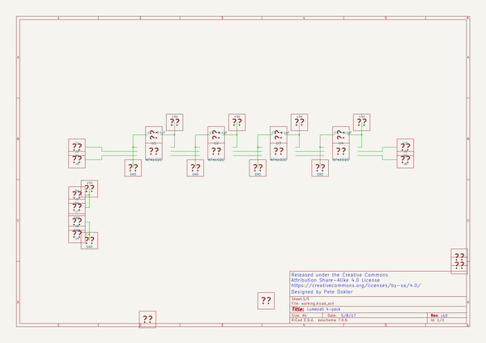
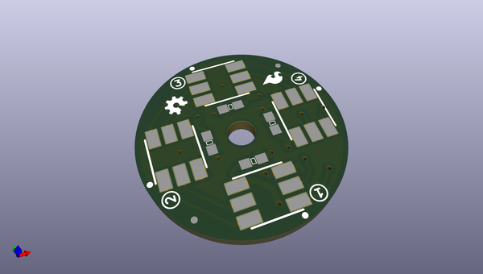
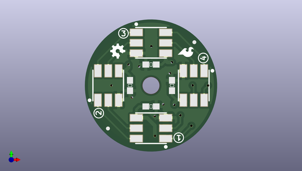
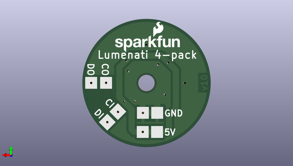

# lumenati_4_pack
 
## summary 
* id: sparkfun_lumenati_4_pack_lumenati_4_pack
* user: sparkfun
* name: lumenati_4_pack
* board: lumenati_4_pack
* repo: https://github.com/sparkfun/Lumenati_4-pack
* src_file_repo_kicad_pcb: Hardware/Lumenati_4-pack.kicad_pcb
* src_file_repo_kicad_pcb_link: https://github.com/sparkfun/Lumenati_4-pack/tree/master/Hardware/Lumenati_4-pack.kicad_pcb

* src_file_repo_sch: Hardware/Lumenati_4-pack.sch
*
 src_file_repo_sch_link: https://github.com/sparkfun/Lumenati_4-pack/tree/master/Hardware/Lumenati_4-pack.sch
* full details link: https://github.com/oomlout/oomlout_oomp_project_bot_v_2/tree/main/projects/sparkfun_lumenati_4_pack_lumenati_4_pack/current_version/working  

## schematic  
  
[schematic (pdf)](working_schematic.pdf)  

## pcb  
 
  
  
  
[board (pdf)](working.pdf)  

## working_bom
| Id | Designator | Footprint | Quantity | Designation | Supplier and ref |  | None | 
| --- | --- | --- | --- | --- | --- | --- | --- | 
| 1 | C1,C2,C3,C4 | 0603_revised | 4 | C |  |  | [''] | 
| 2 | U1,U2,U3,U4 | APA102_3 | 4 | APA102C |  |  | [''] | 
| 3 | , | FIDUCIAL-MICRO | 2 |  |  |  | [''] | 
| 4 | J1,J7 | solder_pad_2 | 2 | 5V |  |  | [''] | 
| 5 | J2 | solder_pad_2 | 1 | CI |  |  | [''] | 
| 6 | J3 | solder_pad_2 | 1 | DI |  |  | [''] | 
| 7 | J4,J8 | solder_pad_2 | 2 | GND |  |  | [''] | 
| 8 | J5 | solder_pad_2 | 1 | CO |  |  | [''] | 
| 9 | J6 | solder_pad_2 | 1 | DO |  |  | [''] | 

## bom_schematic
no data

