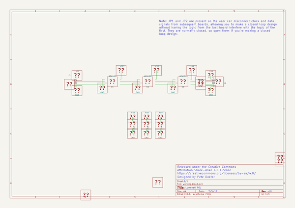
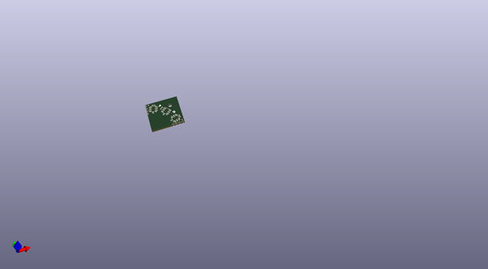
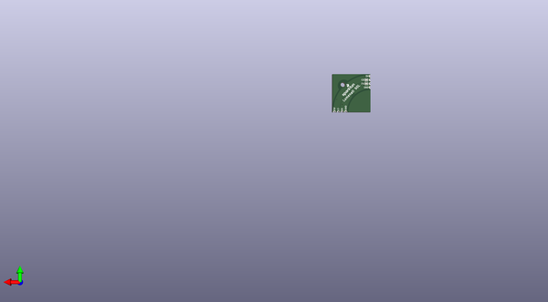

# lumenati_90l
 
## summary 
* id: sparkfun_lumenati_90l_lumenati_90l
* user: sparkfun
* name: lumenati_90l
* board: lumenati_90l
* repo: https://github.com/sparkfun/Lumenati_90L
* src_file_repo_kicad_pcb: Hardware/Lumenati_90L.kicad_pcb
* src_file_repo_kicad_pcb_link: https://github.com/sparkfun/Lumenati_90L/tree/master/Hardware/Lumenati_90L.kicad_pcb

* src_file_repo_sch: Hardware/Lumenati_90L.sch
*
 src_file_repo_sch_link: https://github.com/sparkfun/Lumenati_90L/tree/master/Hardware/Lumenati_90L.sch
* full details link: https://github.com/oomlout/oomlout_oomp_project_bot_v_2/tree/main/projects/sparkfun_lumenati_90l_lumenati_90l/current_version/working  

## schematic  
  
[schematic (pdf)](working_schematic.pdf)  

## pcb  
 
  
  
  
[board (pdf)](working.pdf)  

## working_bom
| Id | Designator | Footprint | Quantity | Designation | Supplier and ref |  | None | 
| --- | --- | --- | --- | --- | --- | --- | --- | 
| 1 | C1,C2,C3 | 0603_revised | 3 | 0.1uF |  |  | [''] | 
| 2 | FD1,FD2 | FIDUCIAL-1X2 | 2 | FIDUCIAL1X2 |  |  | [''] | 
| 3 | U1,U2,U3 | APA102_3 | 3 | APA102 |  |  | [''] | 
| 4 | REF**,REF**,REF** | line | 3 | line |  |  | [''] | 
| 5 | JP1,JP2 | SMT-JUMPER_2_NC_TRACE_SILK | 2 | JUMPER-SMT_2_NC_TRACE_SILK |  |  | [''] | 

## bom_schematic
no data

