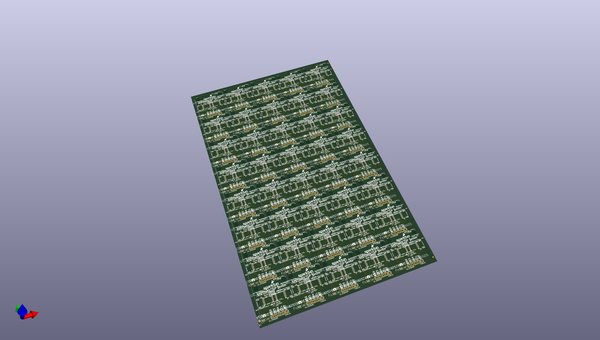
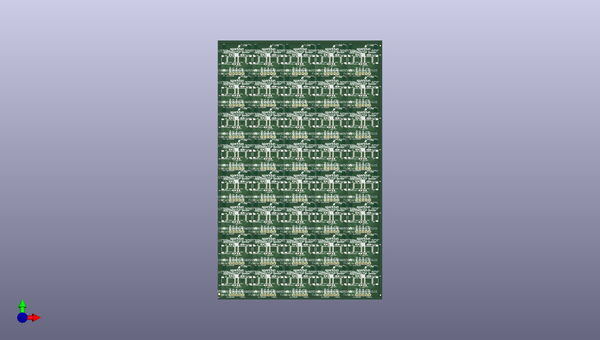
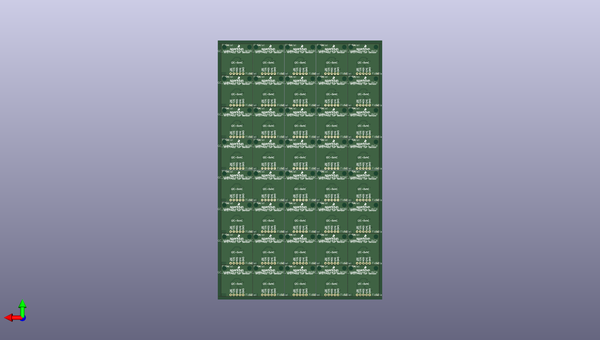

# qwiic_distance_rfd77402
 
## summary 
* id: sparkfun_qwiic_distance_rfd77402_13871_qwiic_distance_sensor_panel_v10
* user: sparkfun
* name: qwiic_distance_rfd77402
* board: 13871_qwiic_distance_sensor_panel_v10
* repo: https://github.com/sparkfun/Qwiic_Distance_RFD77402
* src_file_repo_kicad_pcb: Panel/13871-Qwiic.Distance.Sensor-panel.v10.kicad_pcb
* src_file_repo_kicad_pcb_link: https://github.com/sparkfun/Qwiic_Distance_RFD77402/tree/master/Panel/13871-Qwiic.Distance.Sensor-panel.v10.kicad_pcb

* src_file_repo_sch: Hardware/RFD77402_ToF_Sensor.sch
*
 src_file_repo_sch_link: https://github.com/sparkfun/Qwiic_Distance_RFD77402/tree/master/Hardware/RFD77402_ToF_Sensor.sch
* full details link: https://github.com/oomlout/oomlout_oomp_project_bot_v_2/tree/main/projects/sparkfun_qwiic_distance_rfd77402_13871_qwiic_distance_sensor_panel_v10/current_version/working  

## pcb  
 
  
  
  
[board (pdf)](working.pdf)  

## working_bom
| Id | Designator | Footprint | Quantity | Designation | Supplier and ref |  | None | 
| --- | --- | --- | --- | --- | --- | --- | --- | 
| 1 | JP1,JP1,JP1,JP1,JP1,JP1,JP1,JP1,JP1,JP1,JP1,JP1,JP1,JP1,JP1,JP1,JP1,JP1,JP1,JP1,JP1,JP1,JP1,JP1,JP1,JP1,JP1,JP1,JP1,JP1,JP1,JP1,JP1,JP1,JP1,JP1,JP1,JP1,JP1,JP1 | SMT-JUMPER_3_2-NC_PASTE_SILK | 40 | JUMPER-SMT_3_2-NC_PASTE_SILK |  |  | [''] | 
| 2 | LOGO1,LOGO1,LOGO1,LOGO1,LOGO1,LOGO1,LOGO1,LOGO1,LOGO1,LOGO1,LOGO1,LOGO1,LOGO1,LOGO1,LOGO1,LOGO1,LOGO1,LOGO1,LOGO1,LOGO1,LOGO1,LOGO1,LOGO1,LOGO1,LOGO1,LOGO1,LOGO1,LOGO1,LOGO1,LOGO1,LOGO1,LOGO1,LOGO1,LOGO1,LOGO1,LOGO1,LOGO1,LOGO1,LOGO1,LOGO1 | OSHW-LOGO-MINI | 40 | SPARKFUN-AESTHETICS_OSHW-LOGOS |  |  | [''] | 
| 3 | MK1,MK2,MK1,MK2,MK1,MK2,MK1,MK2,MK1,MK2,MK2,MK1,MK1,MK2,MK1,MK2,MK1,MK2,MK1,MK2,MK2,MK1,MK1,MK2,MK1,MK2,MK1,MK2,MK1,MK2,MK2,MK1,MK1,MK2,MK1,MK2,MK1,MK2,MK1,MK2,MK2,MK1,MK1,MK2,MK1,MK2,MK1,MK2,MK1,MK2,MK2,MK1,MK1,MK2,MK1,MK2,MK1,MK2,MK1,MK2,MK2,MK1,MK1,MK2,MK1,MK2,MK1,MK2,MK1,MK2,MK2,MK1,MK1,MK2,MK1,MK2,MK1,MK2,MK1,MK2 | STAND-OFF | 80 | Mounting_Hole |  |  | [''] | 
| 4 | C1,C1,C1,C1,C1,C1,C1,C1,C1,C1,C1,C1,C1,C1,C1,C1,C1,C1,C1,C1,C1,C1,C1,C1,C1,C1,C1,C1,C1,C1,C1,C1,C1,C1,C1,C1,C1,C1,C1,C1 | 0603 | 40 | 0.1UF-0603-25V-_+80_-20%_ |  |  | [''] | 
| 5 | C2,C2,C2,C2,C2,C2,C2,C2,C2,C2,C2,C2,C2,C2,C2,C2,C2,C2,C2,C2,C2,C2,C2,C2,C2,C2,C2,C2,C2,C2,C2,C2,C2,C2,C2,C2,C2,C2,C2,C2 | 0603 | 40 | 4.7UF0603 |  |  | [''] | 
| 6 | J1,J2,J1,J2,J1,J2,J1,J2,J1,J2,J2,J1,J1,J2,J1,J2,J1,J2,J1,J2,J2,J1,J1,J2,J1,J2,J1,J2,J1,J2,J2,J1,J1,J2,J1,J2,J1,J2,J1,J2,J2,J1,J1,J2,J1,J2,J1,J2,J1,J2,J2,J1,J1,J2,J1,J2,J1,J2,J1,J2,J2,J1,J1,J2,J1,J2,J1,J2,J1,J2,J2,J1,J1,J2,J1,J2,J1,J2,J1,J2 | 1X04_1MM_RA | 80 | QWIIC_CONNECTORJS-1MM |  |  | [''] | 
| 7 | R1,R2,R2,R1,R2,R1,R2,R1,R2,R1,R2,R1,R2,R1,R2,R1,R1,R2,R1,R2,R2,R1,R2,R1,R2,R1,R1,R2,R1,R2,R2,R1,R2,R1,R2,R1,R1,R2,R1,R2,R2,R1,R2,R1,R2,R1,R1,R2,R1,R2,R2,R1,R2,R1,R2,R1,R1,R2,R1,R2,R2,R1,R2,R1,R2,R1,R1,R2,R1,R2,R2,R1,R2,R1,R2,R1,R1,R2,R1,R2 | 0603 | 80 | 4.7KOHM-0603-1_10W-1% |  |  | [''] | 
| 8 | U1,U1,U1,U1,U1,U1,U1,U1,U1,U1,U1,U1,U1,U1,U1,U1,U1,U1,U1,U1,U1,U1,U1,U1,U1,U1,U1,U1,U1,U1,U1,U1,U1,U1,U1,U1,U1,U1,U1,U1 | RFD77402 | 40 | RFD77402 |  |  | [''] | 
| 9 | F1,F2,F1,F2,F1,F2,F1,F2,F1,F1,F2,F2,F1,F1,F2,F1,F2,F2,F1,F1,F2,F2,F1,F1,F2,F1,F2,F2,F1,F1,F2,F2,F1,F1,F2,F1,F2,F2,F1,F1,F2,F2,F1,F1,F2,F1,F2,F2,F1,F1,F2,F2,F1,F1,F2,F1,F2,F2,F1,F1,F2,F2,F1,F1,F2,F1,F2,F2,F1,F1,F2,F2,F1,F1,F2,F1,F2,F2,F1,F2,F3,F4,F3,F4,F3,F4,F3,F4,F3,F4,F3,F4,F4,F3,F3,F4,F4,F3,F3,F4,F3,F4,F4,F3,F3,F4,F4,F3,F3,F4,F3,F4,F4,F3,F3,F4,F4,F3,F3,F4,F3,F4,F4,F3,F3,F4,F4,F3,F3,F4,F3,F4,F4,F3,F3,F4,F4,F3,F3,F4,F3,F4,F4,F3,F3,F4,F4,F3,F3,F4,F3,F4,F4,F3,F3,F4,F4,F3,F3,F4 | FIDUCIAL-MICRO-NO_PASTE | 160 | Fiducial |  |  | [''] | 
| 10 | Ref** | FIDUCIAL-FRAME-1_5MM-no.paste | 1 | Val** |  |  | [''] | 
| 11 | , | FIDUCIAL-1X2-no.paste | 2 |  |  |  | [''] | 

