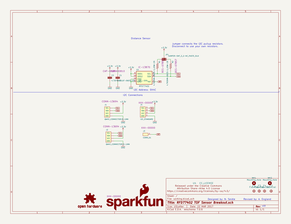
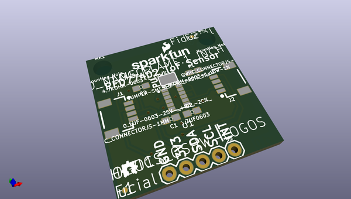
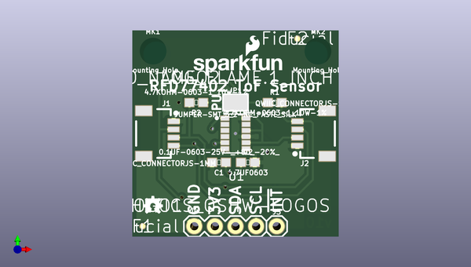
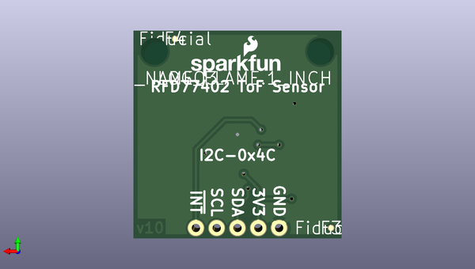

# qwiic_distance_rfd77402
 
## summary 
* id: sparkfun_qwiic_distance_rfd77402_rfd77402_tof_sensor
* user: sparkfun
* name: qwiic_distance_rfd77402
* board: rfd77402_tof_sensor
* repo: https://github.com/sparkfun/Qwiic_Distance_RFD77402
* src_file_repo_kicad_pcb: Hardware/RFD77402_ToF_Sensor.kicad_pcb
* src_file_repo_kicad_pcb_link: https://github.com/sparkfun/Qwiic_Distance_RFD77402/tree/master/Hardware/RFD77402_ToF_Sensor.kicad_pcb

* src_file_repo_sch: Hardware/RFD77402_ToF_Sensor.sch
*
 src_file_repo_sch_link: https://github.com/sparkfun/Qwiic_Distance_RFD77402/tree/master/Hardware/RFD77402_ToF_Sensor.sch
* full details link: https://github.com/oomlout/oomlout_oomp_project_bot_v_2/tree/main/projects/sparkfun_qwiic_distance_rfd77402_rfd77402_tof_sensor/current_version/working  

## schematic  
  
[schematic (pdf)](working_schematic.pdf)  

## pcb  
 
  
  
  
[board (pdf)](working.pdf)  

## working_bom
| Id | Designator | Footprint | Quantity | Designation | Supplier and ref |  | None | 
| --- | --- | --- | --- | --- | --- | --- | --- | 
| 1 | JP1 | SMT-JUMPER_3_2-NC_PASTE_SILK | 1 | JUMPER-SMT_3_2-NC_PASTE_SILK |  |  | [''] | 
| 2 | LOGO1 | OSHW-LOGO-MINI | 1 | SPARKFUN-AESTHETICS_OSHW-LOGOS |  |  | [''] | 
| 3 | MK1,MK2 | STAND-OFF | 2 | Mounting_Hole |  |  | [''] | 
| 4 | U4 | CREATIVE_COMMONS | 1 | CC_LICENSE |  |  | [''] | 
| 5 | C1 | 0603 | 1 | 0.1UF-0603-25V-_+80_-20%_ |  |  | [''] | 
| 6 | C2 | 0603 | 1 | 4.7UF0603 |  |  | [''] | 
| 7 | J1,J2 | 1X04_1MM_RA | 2 | QWIIC_CONNECTORJS-1MM |  |  | [''] | 
| 8 | R1,R2 | 0603 | 2 | 4.7KOHM-0603-1_10W-1% |  |  | [''] | 
| 9 | U1 | RFD77402 | 1 | RFD77402 |  |  | [''] | 
| 10 | F1,F2,F3,F4 | FIDUCIAL-MICRO-NO_PASTE | 4 | Fiducial |  |  | [''] | 

## bom_schematic
| Ref | Qnty | Value | Cmp name | Footprint | Description | Vendor | DNP | 
| --- | --- | --- | --- | --- | --- | --- | --- | 
| C1 | 1 | 0.1UF-0603-25V-_+80_-20%_ | 0.1UF-0603-25V-_+80_-20%__2 | Capacitors:0603 |  |  |  | 
| C2 | 1 | 4.7UF0603 | 4.7UF0603_2 | Capacitors:0603 |  |  |  | 
| F1, F2, F3, F4 | 4 | Fiducial | Fiducial | Aesthetics:FIDUCIAL-MICRO-NO_PASTE |  |  |  | 
| J1, J2 | 2 | QWIIC_CONNECTORJS-1MM | QWIIC_CONNECTORJS-1MM_3 | Connectors:1X04_1MM_RA |  |  |  | 
| J3 | 1 | CONN_01 | CONN_01_2 | Connectors:1X01 |  |  |  | 
| J4 | 1 | I2C_STANDARD | I2C_STANDARD_2 | Connectors:1X04 |  |  |  | 
| JP1 | 1 | JUMPER-SMT_3_2-NC_PASTE_SILK | JUMPER-SMT_3_2-NC_PASTE_SILK | SparkFun-Jumpers:SMT-JUMPER_3_2-NC_PASTE_SILK |  |  |  | 
| LOGO1 | 1 | SPARKFUN-AESTHETICS_OSHW-LOGOS | SPARKFUN-AESTHETICS_OSHW-LOGOS | SparkFun-Aesthetics:OSHW-LOGO-MINI |  |  |  | 
| LOGO2, LOGO3 | 2 | SFE_LOGO_NAME_FLAME.1_INCH | SFE_LOGO_NAME_FLAME.1_INCH_4 | Aesthetics:SFE_LOGO_NAME_FLAME_.1 |  |  |  | 
| MK1, MK2 | 2 | Mounting_Hole | Mounting_Hole | SparkFun-Hardware:STAND-OFF |  |  |  | 
| R1, R2 | 2 | 4.7KOHM-0603-1_10W-1% | 4.7KOHM-0603-1_10W-1%_3 | Resistors:0603 |  |  |  | 
| U1 | 1 | RFD77402 | RFD77402_2 | Silicon-Custom:RFD77402 |  |  |  | 
| U4 | 1 | CC_LICENSE | CC_LICENSE | SparkFun-Aesthetics:CREATIVE_COMMONS |  |  |  | 

