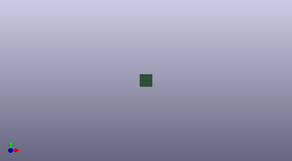

# qwiic_joystick
 
## summary 
* id: sparkfun_qwiic_joystick_joystiicv1_1_panel
* user: sparkfun
* name: qwiic_joystick
* board: joystiicv1_1_panel
* repo: https://github.com/sparkfun/Qwiic_Joystick
* src_file_repo_kicad_pcb: Hardware/Panel/joystiicv1.1_panel.kicad_pcb
* src_file_repo_kicad_pcb_link: https://github.com/sparkfun/Qwiic_Joystick/tree/master/Hardware/Panel/joystiicv1.1_panel.kicad_pcb

* src_file_repo_sch: 
*
 src_file_repo_sch_link: https://github.com/sparkfun/Qwiic_Joystick/tree/master/
* full details link: https://github.com/oomlout/oomlout_oomp_project_bot_v_2/tree/main/projects/sparkfun_qwiic_joystick_joystiicv1_1_panel/current_version/working  

## pcb  
 
  
  
  
[board (pdf)](working.pdf)  

