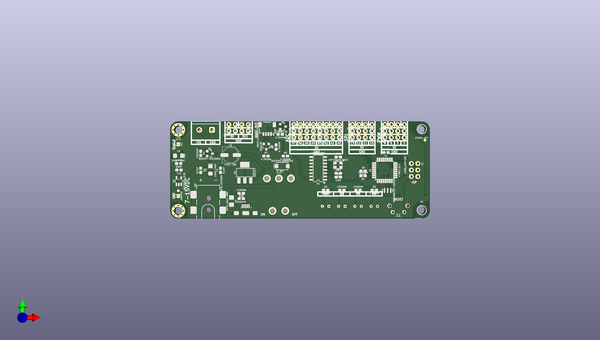

# redboard_edge
 
## summary 
* id: sparkfun_redboard_edge_redboard_edge
* user: sparkfun
* name: redboard_edge
* board: redboard_edge
* repo: https://github.com/sparkfun/RedBoard_Edge
* src_file_repo_kicad_pcb: Hardware/RedBoard_Edge.kicad_pcb
* src_file_repo_kicad_pcb_link: https://github.com/sparkfun/RedBoard_Edge/tree/master/Hardware/RedBoard_Edge.kicad_pcb

* src_file_repo_brd: Hardware/modified_eagle_files/RedBoard.brd
* src_file_repo_brd_link: https://github.com/sparkfun/RedBoard_Edge/tree/master/Hardware/modified_eagle_files/RedBoard.brd
* src_file_repo_sch: Hardware/RedBoard_Edge.sch
*
 src_file_repo_sch_link: https://github.com/sparkfun/RedBoard_Edge/tree/master/Hardware/RedBoard_Edge.sch
* full details link: https://github.com/oomlout/oomlout_oomp_project_bot_v_2/tree/main/projects/sparkfun_redboard_edge_redboard_edge/current_version/working  

## schematic  
  
[schematic (pdf)](working_schematic.pdf)  

## pcb  
 
  
  
  
[board (pdf)](working.pdf)  

## working_bom
| Id | Designator | Footprint | Quantity | Designation | Supplier and ref |  | None | 
| --- | --- | --- | --- | --- | --- | --- | --- | 
| 1 | J4 | USB-B-MICRO-SMD | 1 | USB_MICRO-B |  |  | [''] | 
| 2 | C1,C2,C4,C8,C12 | 0603 | 5 | 0.1UF |  |  | [''] | 
| 3 | C3,C6 | EIA3216 | 2 | 10UF-TANT |  |  | [''] | 
| 4 | C7 | 0603 | 1 | 1.0UF |  |  | [''] | 
| 5 | C9,C10 | 0603 | 2 | 10PF |  |  | [''] | 
| 6 | C11 | 0603 | 1 | 10NF |  |  | [''] | 
| 7 | D1 | SMA-DIODE | 1 | SHOTTKY_MBRA140 |  |  | [''] | 
| 8 | D2 | LED_550_T1-.75_RT_ANG_PCB | 1 | LED-YELLOW |  |  | [''] | 
| 9 | D3 | LED_550_T1-.75_RT_ANG_PCB | 1 | LED-GREEN |  |  | [''] | 
| 10 | D4 | LED_550_T1-.75_RT_ANG_PCB | 1 | LED-RED |  |  | [''] | 
| 11 | D5 | LED_550_T1-.75_RT_ANG_PCB | 1 | LED-BLUE |  |  | [''] | 
| 12 | F1 | 1206 | 1 | PPTC_HALF-AMP |  |  | [''] | 
| 13 | JP1,JP2 | SMT-JUMPER_2_NO_NO-SILK | 2 | JUMPER |  |  | [''] | 
| 14 | Q1 | SOT23-3 | 1 | MOSFET-SI2309DS |  |  | [''] | 
| 15 | Q2,Q3 | SOT23-3 | 2 | BSS138 |  |  | [''] | 
| 16 | R1,R2,R5,R6 | 0603 | 4 | 470OHM |  |  | [''] | 
| 17 | R3,R4 | 0603 | 2 | 10KOHM |  |  | [''] | 
| 18 | R7,R9,R8,R10 | 0603 | 4 | 4.7KOHM |  |  | [''] | 
| 19 | R14 | 0603 | 1 | 715OHM |  |  | [''] | 
| 20 | R15 | 0603 | 1 | 240OHM |  |  | [''] | 
| 21 | U1 | SO16 | 1 | CH340GSMD |  |  | [''] | 
| 22 | U2 | SOT23-5 | 1 | MIC5205-3.3V |  |  | [''] | 
| 23 | U3,U5 | STANDOFF_GROUNDING | 2 | Standoff_Grounding |  |  | [''] | 
| 24 | U4 | TQFP32-08 | 1 | ATMEGA328 |  |  | [''] | 
| 25 | Y1 | RESONATOR-SMD-3.2X1.3 | 1 | RESONATOR-16MHZ |  |  | [''] | 
| 26 | U6 | SOT223 | 1 | LM1117 |  |  | [''] | 
| 27 | J20 | POWER_JACK_SMD_GND | 1 | POWER_JACKSMD |  |  | [''] | 
| 28 | S1 | SWITCH TACTILE SPST-NO 0.05A 12V | 1 | MOMENTARY-SWITCH |  |  | [''] | 
| 29 | C5 | PANASONIC_D | 1 | 47UF-35V |  |  | [''] | 
| 30 | FD2,FD3,FD1,FD4 | FIDUCIAL-1X2 | 4 | FIDUCIAL1X2 |  |  | [''] | 
| 31 | J17 | 1X04_1MM_RA | 1 | QWIIC_CONNECTORJS-1MM |  |  | [''] | 
| 32 | S2 | TOGGLE_SWITCH-102-C3 | 1 | SWITCH_TOGGLE |  |  | [''] | 
| 33 | Y2 | CRYSTAL-SMD-3.2X2.5MM | 1 | CRYSTAL-12MHZ |  |  | [''] | 

## bom_schematic
no data

