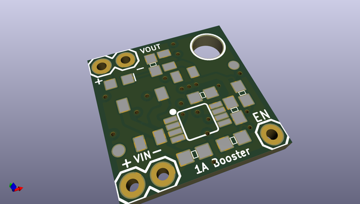
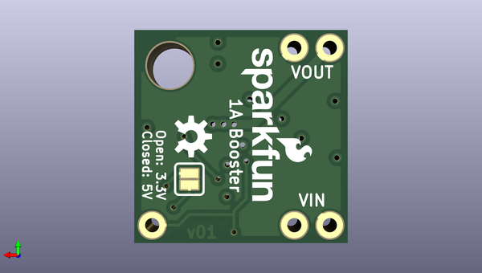

# sparkfun_kicad_libraries
 
## summary 
* id: sparkfun_sparkfun_kicad_libraries_boostboard1
* user: sparkfun
* name: sparkfun_kicad_libraries
* board: boostboard1
* repo: https://github.com/sparkfun/SparkFun-KiCad-Libraries
* src_file_repo_kicad_pcb: Pre_v7/Documentation/Example Project/boostboard1.kicad_pcb
* src_file_repo_kicad_pcb_link: https://github.com/sparkfun/SparkFun-KiCad-Libraries/tree/main/Pre_v7/Documentation/Example Project/boostboard1.kicad_pcb

* src_file_repo_sch: Pre_v7/Documentation/Example Project/boostboard1.sch
*
 src_file_repo_sch_link: https://github.com/sparkfun/SparkFun-KiCad-Libraries/tree/main/Pre_v7/Documentation/Example Project/boostboard1.sch
* full details link: https://github.com/oomlout/oomlout_oomp_project_bot_v_2/tree/main/projects/sparkfun_sparkfun_kicad_libraries_boostboard1/current_version/working  

## schematic  
  
[schematic (pdf)](working_schematic.pdf)  

## pcb  
 
  
  
  
[board (pdf)](working.pdf)  

## working_bom
| Id | Designator | Footprint | Quantity | Designation | Supplier and ref |  | None | 
| --- | --- | --- | --- | --- | --- | --- | --- | 
| 1 | C1,C2,C3 | 0805 | 3 | 22UF-0805-6.3V-20% |  |  | [''] | 
| 2 | D1 | LED-0603 | 1 | LED-RED0603 |  |  | [''] | 
| 3 | FD1,FD2 | FIDUCIAL-1X2 | 2 | FIDUCIAL1X2 |  |  | [''] | 
| 4 | L1 | INDUCTOR_2.2UH | 1 | INDUCTOR-CDRH-4.7UH |  |  | [''] | 
| 5 | R1 | 0603 | 1 | 10KOHM-0603-1_10W-1% |  |  | [''] | 
| 6 | R2,R4 | 0603 | 2 | 100KOHM-0603-1_10W-1% |  |  | [''] | 
| 7 | R3,R5 | 0603 | 2 | 820KOHM-0603-1_10W-1% |  |  | [''] | 
| 8 | R6 | 0603 | 1 | 4.7KOHM-0603-1_10W-1% |  |  | [''] | 
| 9 | U1 | MSOP8 | 1 | PAM2401 |  |  | [''] | 
| 10 | JP1 | SMT-JUMPER_2_NO_SILK | 1 | JUMPER-SMT_2_NO |  |  | [''] | 

## bom_schematic
| Ref | Qnty | Value | Cmp name | Footprint | Description | Vendor | DNP | 
| --- | --- | --- | --- | --- | --- | --- | --- | 
| C1, C2, C3 | 3 | 22UF-0805-6.3V-20% | 22UF-0805-6.3V-20%_6 | Capacitors:0805 |  |  |  | 
| D1 | 1 | LED-RED0603 | LED-RED0603_2 | LED:LED-0603 |  |  |  | 
| FD1, FD2 | 2 | FIDUCIAL1X2 | FIDUCIAL1X2_4 | Aesthetics:FIDUCIAL-1X2 |  |  |  | 
| H1 | 1 | STAND-OFF | STAND-OFF_2 | Hardware:STAND-OFF |  |  |  | 
| J1, J3 | 2 | CONN_02 | CONN_02_4 | Connectors:1X02 |  |  |  | 
| J2 | 1 | CONN_01 | CONN_01_2 | Connectors:1X01 |  |  |  | 
| JP1 | 1 | JUMPER-SMT_2_NO | JUMPER-SMT_2_NO | Jumpers:SMT-JUMPER_2_NO_SILK |  |  |  | 
| L1 | 1 | INDUCTOR-CDRH-4.7UH | INDUCTOR-CDRH-4.7UH_2 | Coils:INDUCTOR_2.2UH |  |  |  | 
| LOGO1 | 1 | SFE_LOGO_NAME_FLAME.1_INCH | SFE_LOGO_NAME_FLAME.1_INCH_2 | Aesthetics:SFE_LOGO_NAME_FLAME_.1 |  |  |  | 
| LOGO2 | 1 | OSHW-LOGOS | OSHW-LOGOS_2 | Aesthetics:OSHW-LOGO-S |  |  |  | 
| R1 | 1 | 10KOHM-0603-1_10W-1% | 10KOHM-0603-1_10W-1%_2 | Resistors:0603 |  |  |  | 
| R2, R4 | 2 | 100KOHM-0603-1_10W-1% | 100KOHM-0603-1_10W-1%_4 | Resistors:0603 |  |  |  | 
| R3, R5 | 2 | 820KOHM-0603-1_10W-1% | 820KOHM-0603-1_10W-1%_4 | Resistors:0603 |  |  |  | 
| R6 | 1 | 4.7KOHM-0603-1_10W-1% | 4.7KOHM-0603-1_10W-1%_2 | Resistors:0603 |  |  |  | 
| U1 | 1 | PAM2401 | PAM2401_2 | Silicon-Standard:MSOP8 |  |  |  | 

