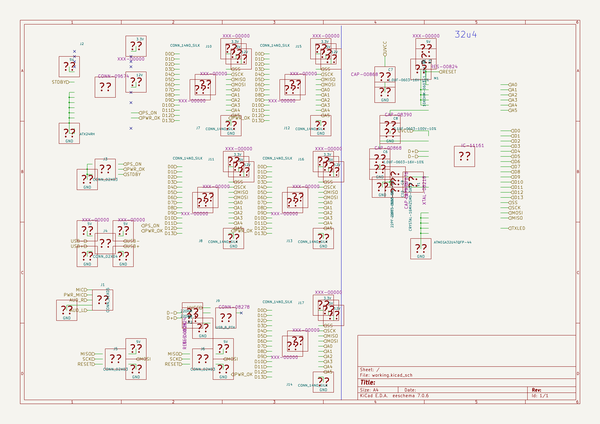
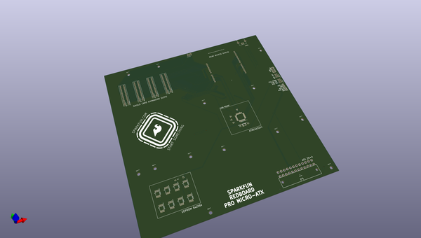
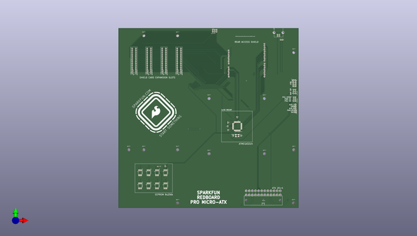
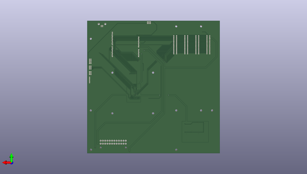

# stupidarduinos
 
## summary 
* id: sparkfun_stupidarduinos_micro_atx
* user: sparkfun
* name: stupidarduinos
* board: micro_atx
* repo: https://github.com/sparkfun/StupidArduinos
* src_file_repo_kicad_pcb: Pro Micro-ATX/Micro-ATX.kicad_pcb
* src_file_repo_kicad_pcb_link: https://github.com/sparkfun/StupidArduinos/tree/master/Pro Micro-ATX/Micro-ATX.kicad_pcb

* src_file_repo_sch: Pro Micro-ATX/Micro-ATX.sch
*
 src_file_repo_sch_link: https://github.com/sparkfun/StupidArduinos/tree/master/Pro Micro-ATX/Micro-ATX.sch
* full details link: https://github.com/oomlout/oomlout_oomp_project_bot_v_2/tree/main/projects/sparkfun_stupidarduinos_micro_atx/current_version/working  

## schematic  
  
[schematic (pdf)](working_schematic.pdf)  

## pcb  
 
  
  
  
[board (pdf)](working.pdf)  

## working_bom
| Id | Designator | Footprint | Quantity | Designation | Supplier and ref |  | None | 
| --- | --- | --- | --- | --- | --- | --- | --- | 
| 1 | C6,C7 | C_0603 | 2 | 1.0UF-0603-16V-10% |  |  | [''] | 
| 2 | C8 | C_0603 | 1 | 0.1UF-0603-100V-10% |  |  | [''] | 
| 3 | C9,C10 | C_0603 | 2 | 22PF-0603-50V-5% |  |  | [''] | 
| 4 | M1 | TQFP44 | 1 | ATMEGA32U4TQFP-44 |  |  | [''] | 
| 5 | R1,R2 | R_0603 | 2 | 22OHM |  |  | [''] | 
| 6 | R3 | R_0603 | 1 | 10KOHM-0603-1_10W-1% |  |  | [''] | 
| 7 | Y1 | CRYSTAL-SMD-5X3.2-4PAD | 1 | CRYSTAL-16MHZSMD-5X3.2 |  |  | [''] | 
| 8 | R4,R5 | R_0603 | 2 | 4.7KOHM |  |  | [''] | 
| 9 | U1,U2,U3,U4,U5,U6,U7,U8 | SO08-EIAJ | 8 | EEPROM-I2CEIAJ |  |  | [''] | 
| 10 | G*** | FLAME | 1 | LOGO |  |  | [''] | 

## bom_schematic
no data

