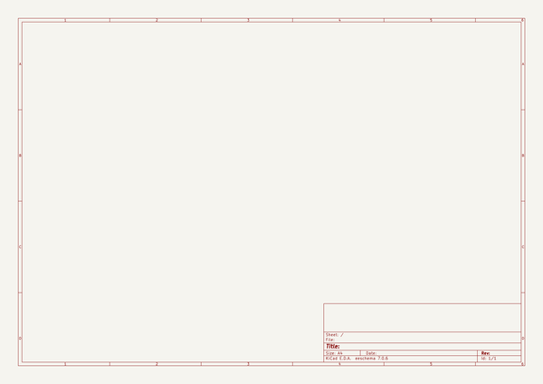
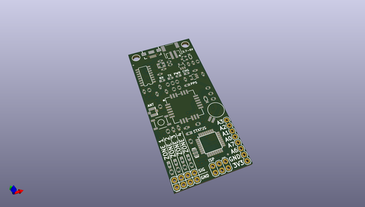
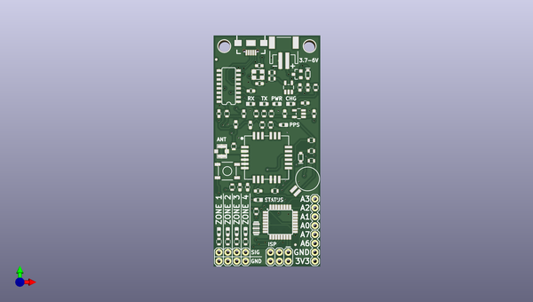
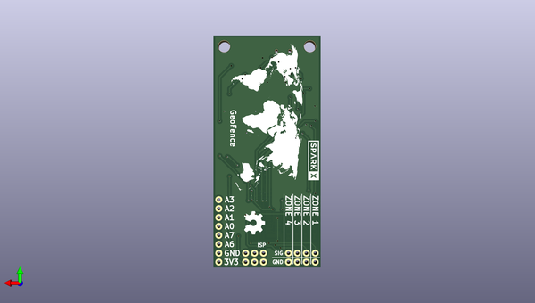

# geofence
 
## summary 
* id: sparkfunx_geofence_geofence
* user: sparkfunx
* name: geofence
* board: geofence
* repo: https://github.com/sparkfunX/GeoFence
* src_file_repo_kicad_pcb: Hardware/GeoFence.kicad_pcb
* src_file_repo_kicad_pcb_link: https://github.com/sparkfunX/GeoFence/tree/master/Hardware/GeoFence.kicad_pcb

* src_file_repo_sch: Hardware/GeoFence.sch
*
 src_file_repo_sch_link: https://github.com/sparkfunX/GeoFence/tree/master/Hardware/GeoFence.sch
* full details link: https://github.com/oomlout/oomlout_oomp_project_bot_v_2/tree/main/projects/sparkfunx_geofence_geofence/current_version/working  

## schematic  
  
[schematic (pdf)](working_schematic.pdf)  

## pcb  
 
  
  
  
[board (pdf)](working.pdf)  

## working_bom
| Id | Designator | Footprint | Quantity | Designation | Supplier and ref |  | None | 
| --- | --- | --- | --- | --- | --- | --- | --- | 
| 1 | C7 | C_0603 | 1 | 2.2uF |  |  | [''] | 
| 2 | C8,C12,C14,C6 | C_0603 | 4 | 1.0uF |  |  | [''] | 
| 3 | C9,C10,C11,C13,C4 | C_0603 | 5 | 0.1uF |  |  | [''] | 
| 4 | Q1 | RESONATOR-SMD-3.2X1.3 | 1 | 8/16/20MHz |  |  | [''] | 
| 5 | R4,R1,R17,R18 | R_0603 | 4 | 1k |  |  | [''] | 
| 6 | R9,R6,R7,R5 | R_0603 | 4 | 10k |  |  | [''] | 
| 7 | R10,R14,R15,R2,R3,R8,R11 | R_0603 | 7 | 470 |  |  | [''] | 
| 8 | R12,R13 | R_0603 | 2 | 4.7k |  |  | [''] | 
| 9 | U3 | SO16 | 1 | CH340G |  |  | [''] | 
| 10 | U5 | TQFP32-08 | 1 | ATMEGA328 |  |  | [''] | 
| 11 | Y1 | CRYSTAL-SMD-3.2X2.5MM | 1 | 12MHz |  |  | [''] | 
| 12 | B1 | SparkX-6.8MM_COIN_CELL | 1 | COIN CELL |  |  | [''] | 
| 13 | C1,C2 | C_0603 | 2 | 10pF |  |  | [''] | 
| 14 | C3 | C_0603 | 1 | 10nF |  |  | [''] | 
| 15 | D1,D5,D6,D7,D8,D9 | LED_0603 | 6 | Blue |  |  | [''] | 
| 16 | D2 | SparkFun-DiscreteSemi-SOD-323 | 1 | 0.5A/40V/420mV |  |  | [''] | 
| 17 | FB1 | L_0603 | 1 | 600Ohm/100MHz |  |  | [''] | 
| 18 | J1 | SparkX-U.FL | 1 | U.FL |  |  | [''] | 
| 19 | J2 | USB-B-MICRO-SMD | 1 | microB |  |  | [''] | 
| 20 | JP2,JP6 | FIDUCIAL-MICRO | 2 | FIDUCIALUFIDUCIAL |  |  | [''] | 
| 21 | L1 | L_0603 | 1 | 33nH/~{5%/500mA} |  |  | [''] | 
| 22 | S1 | TACTILE_SWITCH_SMD_5.2MM | 1 | Reset |  |  | [''] | 
| 23 | U1 | SparkX-TITAN_X1_GPS | 1 | TITAN X1 GPS |  |  | [''] | 
| 24 | C15,C5 | C_0603 | 2 | 4.7uF |  |  | [''] | 
| 25 | D10 | SparkFun-DiscreteSemi-SOD-323 | 1 | BAT20J |  |  | [''] | 
| 26 | Q2 | SparkFun-DiscreteSemi-SOT23-3 | 1 | 2.5A/30V |  |  | [''] | 
| 27 | R16 | R_0603 | 1 | 2.0k |  |  | [''] | 
| 28 | U6 | SOT23-5 | 1 | MCP73831 |  |  | [''] | 
| 29 | U4 | SOT23-5 | 1 | AP2112K-3.3V |  |  | [''] | 
| 30 | D3,D11 | LED_0603 | 2 | Yellow |  |  | [''] | 
| 31 | D4 | LED_0603 | 1 | GREEN |  |  | [''] | 
| 32 | D12 | LED_0603 | 1 | Red |  |  | [''] | 
| 33 | JP8 | JST-2-SMD | 1 | LiPo |  |  | [''] | 
| 34 | G*** | worldmap_silk | 1 | LOGO |  |  | [''] | 
| 35 | G*** | SparkX_Logo | 1 | LOGO |  |  | [''] | 

