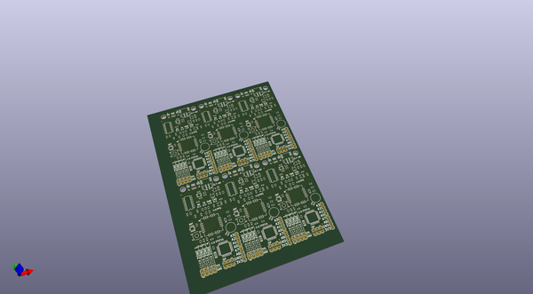
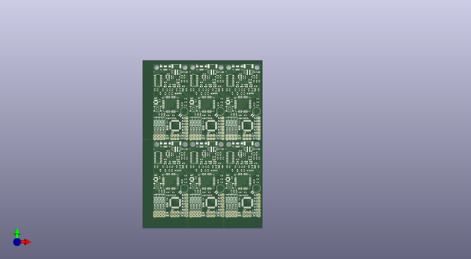
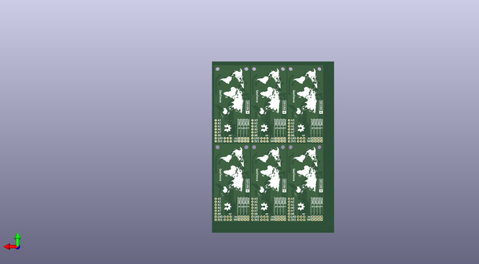

# geofence
 
## summary 
* id: sparkfunx_geofence_geofence_panel
* user: sparkfunx
* name: geofence
* board: geofence_panel
* repo: https://github.com/sparkfunX/GeoFence
* src_file_repo_kicad_pcb: Hardware/Panel/GeoFence_Panel.kicad_pcb
* src_file_repo_kicad_pcb_link: https://github.com/sparkfunX/GeoFence/tree/master/Hardware/Panel/GeoFence_Panel.kicad_pcb

* src_file_repo_sch: Hardware/GeoFence.sch
*
 src_file_repo_sch_link: https://github.com/sparkfunX/GeoFence/tree/master/Hardware/GeoFence.sch
* full details link: https://github.com/oomlout/oomlout_oomp_project_bot_v_2/tree/main/projects/sparkfunx_geofence_geofence_panel/current_version/working  

## pcb  
 
  
  
  
[board (pdf)](working.pdf)  

## working_bom
| Id | Designator | Footprint | Quantity | Designation | Supplier and ref |  | None | 
| --- | --- | --- | --- | --- | --- | --- | --- | 
| 1 | C7,C7,C7,C7,C7,C7 | C_0603 | 6 | 2.2uF |  |  | [''] | 
| 2 | C8,C12,C14,C6,C14,C14,C14,C14,C14,C8,C8,C8,C8,C8,C12,C12,C12,C12,C12,C6,C6,C6,C6,C6 | C_0603 | 24 | 1.0uF |  |  | [''] | 
| 3 | C9,C10,C11,C13,C4,C13,C13,C13,C13,C13,C4,C4,C4,C4,C4,C10,C10,C10,C10,C10,C9,C9,C9,C9,C9,C11,C11,C11,C11,C11 | C_0603 | 30 | 0.1uF |  |  | [''] | 
| 4 | Q1,Q1,Q1,Q1,Q1,Q1 | RESONATOR-SMD-3.2X1.3 | 6 | 8/16/20MHz |  |  | [''] | 
| 5 | R4,R1,R17,R18,R4,R4,R4,R4,R4,R1,R1,R1,R1,R1,R18,R18,R18,R18,R18,R17,R17,R17,R17,R17 | R_0603 | 24 | 1k |  |  | [''] | 
| 6 | R9,R6,R7,R5,R7,R7,R7,R7,R7,R9,R9,R9,R9,R9,R6,R6,R6,R6,R6,R5,R5,R5,R5,R5 | R_0603 | 24 | 10k |  |  | [''] | 
| 7 | R10,R14,R15,R2,R3,R8,R11,R15,R15,R15,R15,R15,R11,R11,R11,R11,R11,R14,R14,R14,R14,R14,R10,R10,R10,R10,R10,R8,R8,R8,R8,R8,R3,R3,R3,R3,R3,R2,R2,R2,R2,R2 | R_0603 | 42 | 470 |  |  | [''] | 
| 8 | R12,R13,R13,R13,R13,R13,R13,R12,R12,R12,R12,R12 | R_0603 | 12 | 4.7k |  |  | [''] | 
| 9 | U3,U3,U3,U3,U3,U3 | SO16 | 6 | CH340G |  |  | [''] | 
| 10 | U5,U5,U5,U5,U5,U5 | TQFP32-08 | 6 | ATMEGA328 |  |  | [''] | 
| 11 | Y1,Y1,Y1,Y1,Y1,Y1 | CRYSTAL-SMD-3.2X2.5MM | 6 | 12MHz |  |  | [''] | 
| 12 | B1,B1,B1,B1,B1,B1 | SparkX-6.8MM_COIN_CELL | 6 | COIN CELL |  |  | [''] | 
| 13 | C1,C2,C2,C2,C2,C2,C2,C1,C1,C1,C1,C1 | C_0603 | 12 | 10pF |  |  | [''] | 
| 14 | C3,C3,C3,C3,C3,C3 | C_0603 | 6 | 10nF |  |  | [''] | 
| 15 | D1,D5,D6,D7,D8,D9,D7,D7,D7,D7,D7,D8,D8,D8,D8,D8,D5,D5,D5,D5,D5,D6,D6,D6,D6,D6,D9,D9,D9,D9,D9,D1,D1,D1,D1,D1 | LED_0603 | 36 | Blue |  |  | [''] | 
| 16 | D2,D2,D2,D2,D2,D2 | SparkFun-DiscreteSemi-SOD-323 | 6 | 0.5A/40V/420mV |  |  | [''] | 
| 17 | FB1,FB1,FB1,FB1,FB1,FB1 | L_0603 | 6 | 600Ohm/100MHz |  |  | [''] | 
| 18 | J1,J1,J1,J1,J1,J1 | SparkX-U.FL | 6 | U.FL |  |  | [''] | 
| 19 | J2,J2,J2,J2,J2,J2 | USB-B-MICRO-SMD | 6 | microB |  |  | [''] | 
| 20 | JP2,JP6,JP2,JP2,JP2,JP2,JP2,JP6,JP6,JP6,JP6,JP6 | FIDUCIAL-MICRO | 12 | FIDUCIALUFIDUCIAL |  |  | [''] | 
| 21 | L1,L1,L1,L1,L1,L1 | L_0603 | 6 | 33nH/~{5%/500mA} |  |  | [''] | 
| 22 | S1,S1,S1,S1,S1,S1 | TACTILE_SWITCH_SMD_5.2MM | 6 | Reset |  |  | [''] | 
| 23 | U1,U1,U1,U1,U1,U1 | SparkX-TITAN_X1_GPS | 6 | TITAN X1 GPS |  |  | [''] | 
| 24 | C15,C5,C15,C15,C15,C15,C15,C5,C5,C5,C5,C5 | C_0603 | 12 | 4.7uF |  |  | [''] | 
| 25 | D10,D10,D10,D10,D10,D10 | SparkFun-DiscreteSemi-SOD-323 | 6 | BAT20J |  |  | [''] | 
| 26 | Q2,Q2,Q2,Q2,Q2,Q2 | SparkFun-DiscreteSemi-SOT23-3 | 6 | 2.5A/30V |  |  | [''] | 
| 27 | R16,R16,R16,R16,R16,R16 | R_0603 | 6 | 2.0k |  |  | [''] | 
| 28 | U6,U6,U6,U6,U6,U6 | SOT23-5 | 6 | MCP73831 |  |  | [''] | 
| 29 | U4,U4,U4,U4,U4,U4 | SOT23-5 | 6 | AP2112K-3.3V |  |  | [''] | 
| 30 | D3,D11,D11,D11,D11,D11,D11,D3,D3,D3,D3,D3 | LED_0603 | 12 | Yellow |  |  | [''] | 
| 31 | D4,D4,D4,D4,D4,D4 | LED_0603 | 6 | GREEN |  |  | [''] | 
| 32 | D12,D12,D12,D12,D12,D12 | LED_0603 | 6 | Red |  |  | [''] | 
| 33 | JP8,JP8,JP8,JP8,JP8,JP8 | JST-2-SMD | 6 | LiPo |  |  | [''] | 
| 34 | G***,G***,G***,G***,G***,G*** | worldmap_silk | 6 | LOGO |  |  | [''] | 
| 35 | G***,G***,G***,G***,G***,G*** | SparkX_Logo | 6 | LOGO |  |  | [''] | 

