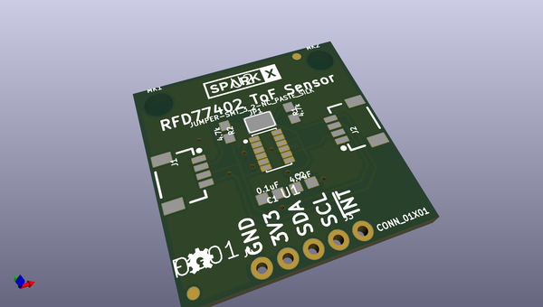
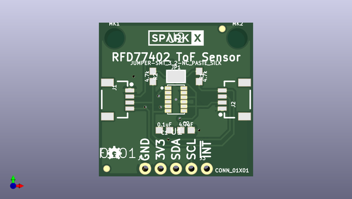
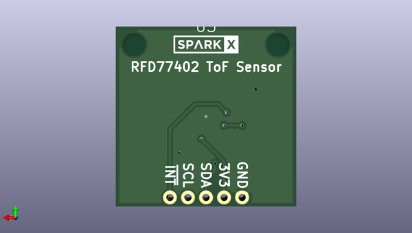

# qwiic_distance_rfd77402
 
## summary 
* id: sparkfunx_qwiic_distance_rfd77402_rfd77402_tof_sensor
* user: sparkfunx
* name: qwiic_distance_rfd77402
* board: rfd77402_tof_sensor
* repo: https://github.com/sparkfunX/Qwiic_Distance-RFD77402
* src_file_repo_kicad_pcb: Hardware/RFD77402 ToF Sensor.kicad_pcb
* src_file_repo_kicad_pcb_link: https://github.com/sparkfunX/Qwiic_Distance-RFD77402/tree/master/Hardware/RFD77402 ToF Sensor.kicad_pcb

* src_file_repo_sch: Hardware/RFD77402 ToF Sensor.sch
*
 src_file_repo_sch_link: https://github.com/sparkfunX/Qwiic_Distance-RFD77402/tree/master/Hardware/RFD77402 ToF Sensor.sch
* full details link: https://github.com/oomlout/oomlout_oomp_project_bot_v_2/tree/main/projects/sparkfunx_qwiic_distance_rfd77402_rfd77402_tof_sensor/current_version/working  

## pcb  
 
  
  
  
[board (pdf)](working.pdf)  

## working_bom
| Id | Designator | Footprint | Quantity | Designation | Supplier and ref |  | None | 
| --- | --- | --- | --- | --- | --- | --- | --- | 
| 1 | J1,J2 | 1X04_1MM_RA | 2 | Qwiic_Connector |  |  | [''] | 
| 2 | J3 | 1X01_NO_SILK | 1 | CONN_01X01 |  |  | [''] | 
| 3 | J4 | 1X04_NO_SILK | 1 | I2C_Standard_PTH_Connector |  |  | [''] | 
| 4 | C1 | 0603 | 1 | 0.1uF |  |  | [''] | 
| 5 | JP1 | SMT-JUMPER_3_2-NC_PASTE_SILK | 1 | JUMPER-SMT_3_2-NC_PASTE_SILK |  |  | [''] | 
| 6 | LOGO1 | OSHW-LOGO-MINI | 1 | SPARKFUN-AESTHETICS_OSHW-LOGOS |  |  | [''] | 
| 7 | MK1,MK2 | STAND-OFF | 2 | Mounting_Hole |  |  | [''] | 
| 8 | R1,R2 | 0603 | 2 | 4.7k |  |  | [''] | 
| 9 | U1 | RFD77402 | 1 | RFD77402 |  |  | [''] | 
| 10 | U4 | CREATIVE_COMMONS | 1 | CC_LICENSE |  |  | [''] | 
| 11 | C2 | 0603 | 1 | 4.7uF |  |  | [''] | 
| 12 | U2,U3 | SPARKX-MEDIUM | 2 | SPARKX-LOGO4 |  |  | [''] | 
| 13 | F1,F2 | FIDUCIAL-1X2 | 2 | Fiducial |  |  | [''] | 

## bom_schematic
| Ref | Qnty | Value | Cmp name | Footprint | Description | Vendor | DNP | 
| --- | --- | --- | --- | --- | --- | --- | --- | 
| C1 | 1 | 0.1uF | C_Small | SparkFun-Capacitors:0603 |  |  |  | 
| C2 | 1 | 4.7uF | C_Small | SparkFun-Capacitors:0603 |  |  |  | 
| F1, F2 | 2 | Fiducial | Fiducial | SparkFun-KiCad-Aesthetics:FIDUCIAL-1X2 |  |  |  | 
| J1, J2 | 2 | Qwiic_Connector | Qwiic_Connector | SparkX:1X04_1MM_RA |  |  |  | 
| J3 | 1 | CONN_01X01 | CONN_01X01 | SparkX:1X01_NO_SILK |  |  |  | 
| J4 | 1 | I2C_Standard_PTH_Connector | I2C_Standard_PTH_Connector | SparkX:1X04_NO_SILK |  |  |  | 
| J5 | 1 | I2C_Standard_PTH_Connector | I2C_Standard_PTH_Connector |  |  |  |  | 
| JP1 | 1 | JUMPER-SMT_3_2-NC_PASTE_SILK | JUMPER-SMT_3_2-NC_PASTE_SILK |  |  |  |  | 
| LOGO1 | 1 | SPARKFUN-AESTHETICS_OSHW-LOGOS | SPARKFUN-AESTHETICS_OSHW-LOGOS | SparkFun-Aesthetics:OSHW-LOGO-MINI |  |  |  | 
| MK1, MK2 | 2 | Mounting_Hole | Mounting_Hole | SparkFun-Hardware:STAND-OFF |  |  |  | 
| R1, R2 | 2 | 4.7k | R_Small | SparkFun-Resistors:0603 |  |  |  | 
| U1 | 1 | RFD77402 | RFD77402 | SparkFun_Kicad-Sensors:RFD77402 |  |  |  | 
| U2, U3 | 2 | SPARKX-LOGO4 | SPARKX_SPARKX-LOGO4 | SparkX:SPARKX-MEDIUM |  |  |  | 
| U4 | 1 | CC_LICENSE | CC_LICENSE | SparkFun-Aesthetics:CREATIVE_COMMONS |  |  |  | 

