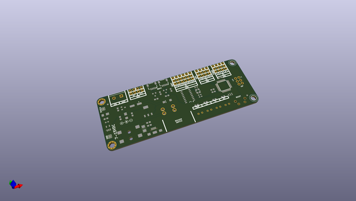
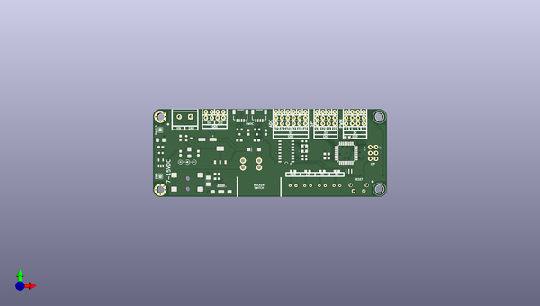
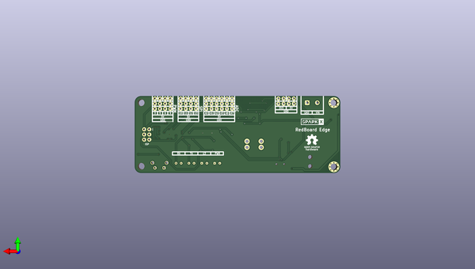

# redboard_edge
 
## summary 
* id: sparkfunx_redboard_edge_redboard_edge
* user: sparkfunx
* name: redboard_edge
* board: redboard_edge
* repo: https://github.com/sparkfunX/RedBoard_Edge
* src_file_repo_kicad_pcb: hardware/RedBoard_Edge.kicad_pcb
* src_file_repo_kicad_pcb_link: https://github.com/sparkfunX/RedBoard_Edge/tree/master/hardware/RedBoard_Edge.kicad_pcb

* src_file_repo_brd: hardware/modified_eagle_files/RedBoard.brd
* src_file_repo_brd_link: https://github.com/sparkfunX/RedBoard_Edge/tree/master/hardware/modified_eagle_files/RedBoard.brd
* src_file_repo_sch: hardware/RedBoard_Edge.sch
*
 src_file_repo_sch_link: https://github.com/sparkfunX/RedBoard_Edge/tree/master/hardware/RedBoard_Edge.sch
* full details link: https://github.com/oomlout/oomlout_oomp_project_bot_v_2/tree/main/projects/sparkfunx_redboard_edge_redboard_edge/current_version/working  

## schematic  
  
[schematic (pdf)](working_schematic.pdf)  

## pcb  
 
  
  
  
[board (pdf)](working.pdf)  

## working_bom
| Id | Designator | Footprint | Quantity | Designation | Supplier and ref |  | None | 
| --- | --- | --- | --- | --- | --- | --- | --- | 
| 1 | J17,J18 | SparkX-1X04_1MM_RA | 2 | Qwiic_Connector |  |  | [''] | 
| 2 | C1,C2,C4,C8 | SPARKFUN-CAPACITORS_0603 | 4 | 0.1uF |  |  | [''] | 
| 3 | C3,C6 | SPARKFUN-CAPACITORS_EIA3216 | 2 | 10uF |  |  | [''] | 
| 4 | C5 | SPARKFUN-CAPACITORS_PANASONIC_D | 1 | 47uF |  |  | [''] | 
| 5 | C7 | SPARKFUN-CAPACITORS_0603 | 1 | 1.0uF |  |  | [''] | 
| 6 | C9,C10 | C_0603 | 2 | 10pF |  |  | [''] | 
| 7 | C11 | C_0603 | 1 | 10nF |  |  | [''] | 
| 8 | C12 | C_0603 | 1 | 0.1uF |  |  | [''] | 
| 9 | D1 | SPARKFUN-DISCRETESEMI_SMA-DIODE | 1 | MBRA140 |  |  | [''] | 
| 10 | D2 | LED_RED_T1-.75_RT_ANG_PCB | 1 | Green |  |  | [''] | 
| 11 | D3 | LED_RED_T1-.75_RT_ANG_PCB | 1 | Yellow |  |  | [''] | 
| 12 | IC3 | TESTING_SOT223-ALT1 | 1 | LM1117 |  |  | [''] | 
| 13 | J3 | TESTING_POWER_JACK_SMD_OVERPASTE_SUPER_BOMB_DIGITY | 1 | POWER_JACKSUPER_BOMB_DIGITY |  |  | [''] | 
| 14 | J4 | USB-B-MICRO-SMD | 1 | microB |  |  | [''] | 
| 15 | JP8,JP9 | SPARKFUN_FIDUCIAL-1X2 | 2 | FIDUCIAL1X2 |  |  | [''] | 
| 16 | Q1 | SPARKFUN-DISCRETESEMI_SOT23-3 | 1 | 1A/60V/500mO |  |  | [''] | 
| 17 | R1,R2,R5,R6 | SPARKFUN-RESISTORS_0603 | 4 | 1k |  |  | [''] | 
| 18 | R3,R4 | SPARKFUN-RESISTORS_0603 | 2 | 10k |  |  | [''] | 
| 19 | R14 | SPARKFUN-RESISTORS_0603 | 1 | 715 |  |  | [''] | 
| 20 | R15 | SPARKFUN-RESISTORS_0603 | 1 | 240 |  |  | [''] | 
| 21 | S1 | SWITCH_TACTILE_SPST-NO_0.05A_12V | 1 | RESET |  |  | [''] | 
| 22 | U1 | SO16 | 1 | CH340G |  |  | [''] | 
| 23 | U2 | SPARKFUN-POWERIC_SOT23-5 | 1 | MIC5205 |  |  | [''] | 
| 24 | U4 | SPARKFUN-IC-MICROCONTROLLER_TQFP32-08 | 1 | ATMEGA328P_TQFP |  |  | [''] | 
| 25 | Y1 | SPARKFUN-CLOCKS_RESONATOR-SMD-3.2X1.3 | 1 | 16MHz |  |  | [''] | 
| 26 | Y2 | CRYSTAL-SMD-3.2X2.5MM | 1 | 12MHz |  |  | [''] | 
| 27 | Q2,Q3 | SparkFun-DiscreteSemi-SOT23-3 | 2 | BSS138 |  |  | [''] | 
| 28 | R7,R8,R9,R10 | SPARKFUN-RESISTORS_0603 | 4 | 4.7k |  |  | [''] | 
| 29 | D4 | LED_RED_T1-.75_RT_ANG_PCB | 1 | Red |  |  | [''] | 
| 30 | D5 | LED_RED_T1-.75_RT_ANG_PCB | 1 | Blue |  |  | [''] | 
| 31 | JP1,JP2 | SMT-JUMPER_2_NO_SILK | 2 | JUMPER-SMT_2_NO_SILK |  |  | [''] | 
| 32 | S2 | RockerSwitch_RA | 1 | SWITCH-SPDT-PTH-11.6X4.0MM |  |  | [''] | 
| 33 | U3,U5 | Standoff_Grounding | 2 | Standoff_Grounding |  |  | [''] | 
| 34 | F1 | SPARKFUN-FUSES_1206 | 1 | PTC .5A |  |  | [''] | 
| 35 | REF** | Symbol_Barrel_Polarity | 1 | Symbol_Barrel_Polarity |  |  | [''] | 
| 36 | G*** | SparkX_Logo | 1 | LOGO |  |  | [''] | 

## bom_schematic
no data

