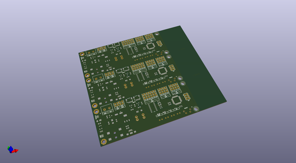
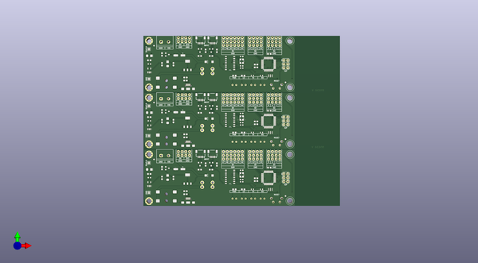
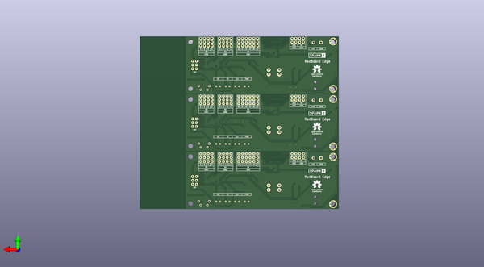

# redboard_edge
 
## summary 
* id: sparkfunx_redboard_edge_redboard_edge_panel
* user: sparkfunx
* name: redboard_edge
* board: redboard_edge_panel
* repo: https://github.com/sparkfunX/RedBoard_Edge
* src_file_repo_kicad_pcb: hardware/Panel/RedBoard_Edge_Panel.kicad_pcb
* src_file_repo_kicad_pcb_link: https://github.com/sparkfunX/RedBoard_Edge/tree/master/hardware/Panel/RedBoard_Edge_Panel.kicad_pcb

* src_file_repo_brd: hardware/modified_eagle_files/RedBoard.brd
* src_file_repo_brd_link: https://github.com/sparkfunX/RedBoard_Edge/tree/master/hardware/modified_eagle_files/RedBoard.brd
* src_file_repo_sch: hardware/RedBoard_Edge.sch
*
 src_file_repo_sch_link: https://github.com/sparkfunX/RedBoard_Edge/tree/master/hardware/RedBoard_Edge.sch
* full details link: https://github.com/oomlout/oomlout_oomp_project_bot_v_2/tree/main/projects/sparkfunx_redboard_edge_redboard_edge_panel/current_version/working  

## pcb  
 
  
  
  
[board (pdf)](working.pdf)  

## working_bom
| Id | Designator | Footprint | Quantity | Designation | Supplier and ref |  | None | 
| --- | --- | --- | --- | --- | --- | --- | --- | 
| 1 | J17,J18,J17,J17,J18,J18 | SparkX-1X04_1MM_RA | 6 | Qwiic_Connector |  |  | [''] | 
| 2 | C1,C2,C4,C8,C8,C8,C1,C1,C2,C2,C4,C4 | SPARKFUN-CAPACITORS_0603 | 12 | 0.1uF |  |  | [''] | 
| 3 | C3,C6,C6,C6,C3,C3 | SPARKFUN-CAPACITORS_EIA3216 | 6 | 10uF |  |  | [''] | 
| 4 | C5,C5,C5 | SPARKFUN-CAPACITORS_PANASONIC_D | 3 | 47uF |  |  | [''] | 
| 5 | C7,C7,C7 | SPARKFUN-CAPACITORS_0603 | 3 | 1.0uF |  |  | [''] | 
| 6 | C9,C10,C10,C10,C9,C9 | C_0603 | 6 | 10pF |  |  | [''] | 
| 7 | C11,C11,C11 | C_0603 | 3 | 10nF |  |  | [''] | 
| 8 | C12,C12,C12 | C_0603 | 3 | 0.1uF |  |  | [''] | 
| 9 | D1,D1,D1 | SPARKFUN-DISCRETESEMI_SMA-DIODE | 3 | MBRA140 |  |  | [''] | 
| 10 | D2,D2,D2 | LED_RED_T1-.75_RT_ANG_PCB | 3 | Green |  |  | [''] | 
| 11 | D3,D3,D3 | LED_RED_T1-.75_RT_ANG_PCB | 3 | Yellow |  |  | [''] | 
| 12 | IC3,IC3,IC3 | TESTING_SOT223-ALT1 | 3 | LM1117 |  |  | [''] | 
| 13 | J3,J3,J3 | TESTING_POWER_JACK_SMD_OVERPASTE_SUPER_BOMB_DIGITY | 3 | POWER_JACKSUPER_BOMB_DIGITY |  |  | [''] | 
| 14 | J4,J4,J4 | USB-B-MICRO-SMD | 3 | microB |  |  | [''] | 
| 15 | JP8,JP9,JP9,JP9,JP8,JP8 | SPARKFUN_FIDUCIAL-1X2 | 6 | FIDUCIAL1X2 |  |  | [''] | 
| 16 | Q1,Q1,Q1 | SPARKFUN-DISCRETESEMI_SOT23-3 | 3 | 1A/60V/500mO |  |  | [''] | 
| 17 | R1,R2,R1,R1,R2,R2 | SPARKFUN-RESISTORS_0603 | 6 | 1k |  |  | [''] | 
| 18 | R3,R4,R3,R3,R4,R4 | SPARKFUN-RESISTORS_0603 | 6 | 10k |  |  | [''] | 
| 19 | R5,R6,R6,R6,R5,R5 | R_0603 | 6 | 1k |  |  | [''] | 
| 20 | R14,R14,R14 | SPARKFUN-RESISTORS_0603 | 3 | 715 |  |  | [''] | 
| 21 | R15,R15,R15 | SPARKFUN-RESISTORS_0603 | 3 | 240 |  |  | [''] | 
| 22 | S1,S1,S1 | SWITCH_TACTILE_SPST-NO_0.05A_12V | 3 | RESET |  |  | [''] | 
| 23 | U1,U1,U1 | SO16 | 3 | CH340G |  |  | [''] | 
| 24 | U2,U2,U2 | SPARKFUN-POWERIC_SOT23-5 | 3 | MIC5205 |  |  | [''] | 
| 25 | U4,U4,U4 | SPARKFUN-IC-MICROCONTROLLER_TQFP32-08 | 3 | ATMEGA328P_TQFP |  |  | [''] | 
| 26 | Y1,Y1,Y1 | SPARKFUN-CLOCKS_RESONATOR-SMD-3.2X1.3 | 3 | 16MHz |  |  | [''] | 
| 27 | Y2,Y2,Y2 | CRYSTAL-SMD-3.2X2.5MM | 3 | 12MHz |  |  | [''] | 
| 28 | Q2,Q3,Q3,Q3,Q2,Q2 | SparkFun-DiscreteSemi-SOT23-3 | 6 | MOSFET-NCH-BSS138 |  |  | [''] | 
| 29 | R7,R8,R9,R10,R9,R9,R8,R8,R10,R10,R7,R7 | SPARKFUN-RESISTORS_0603 | 12 | 4.7k |  |  | [''] | 
| 30 | D4,D4,D4 | LED_RED_T1-.75_RT_ANG_PCB | 3 | Red |  |  | [''] | 
| 31 | D5,D5,D5 | LED_RED_T1-.75_RT_ANG_PCB | 3 | Blue |  |  | [''] | 
| 32 | JP1,JP2,JP1,JP1,JP2,JP2 | SMT-JUMPER_2_NO_SILK | 6 | JUMPER-SMT_2_NO_SILK |  |  | [''] | 
| 33 | S2,S2,S2 | RockerSwitch_RA | 3 | SWITCH-SPDT-PTH-11.6X4.0MM |  |  | [''] | 
| 34 | U3,U5,U3,U3,U5,U5 | Standoff_Grounding | 6 | Standoff_Grounding |  |  | [''] | 
| 35 | G***,G***,G*** | SparkX_Logo | 3 | LOGO |  |  | [''] | 

